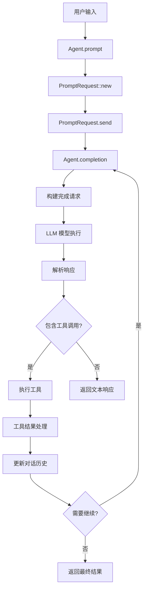
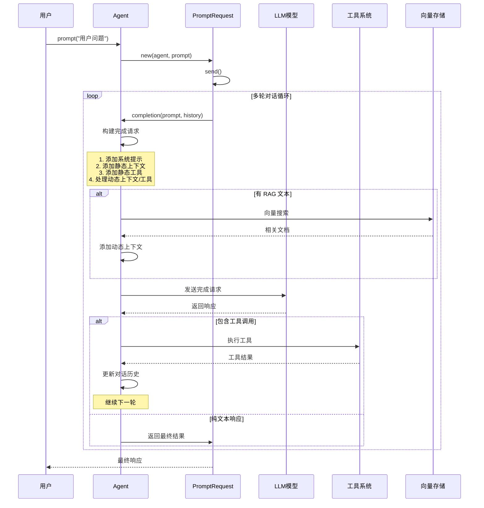
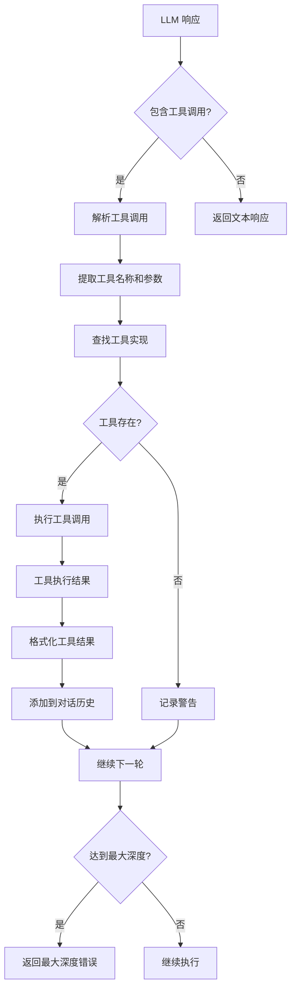
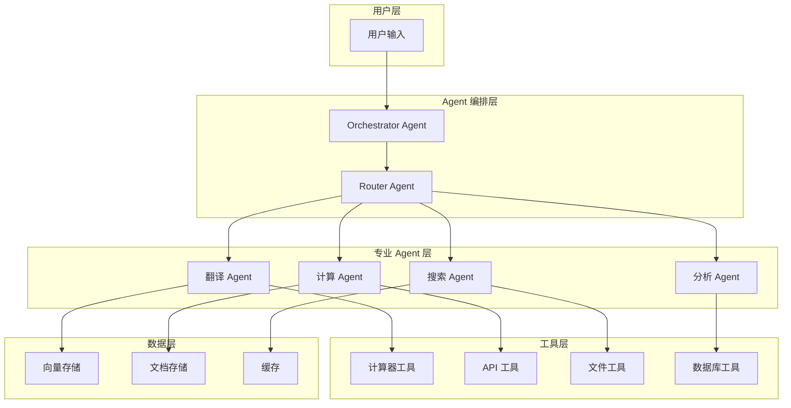
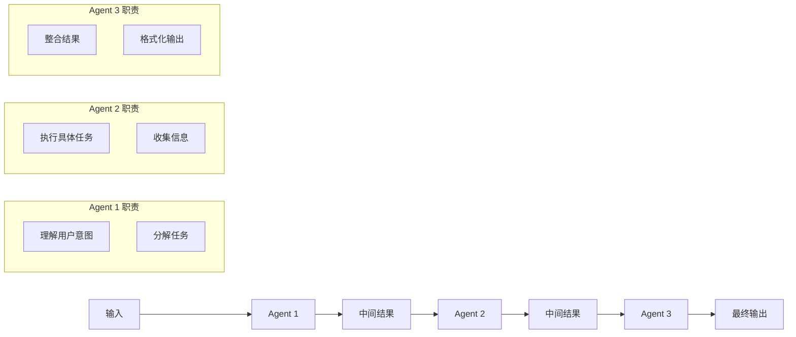
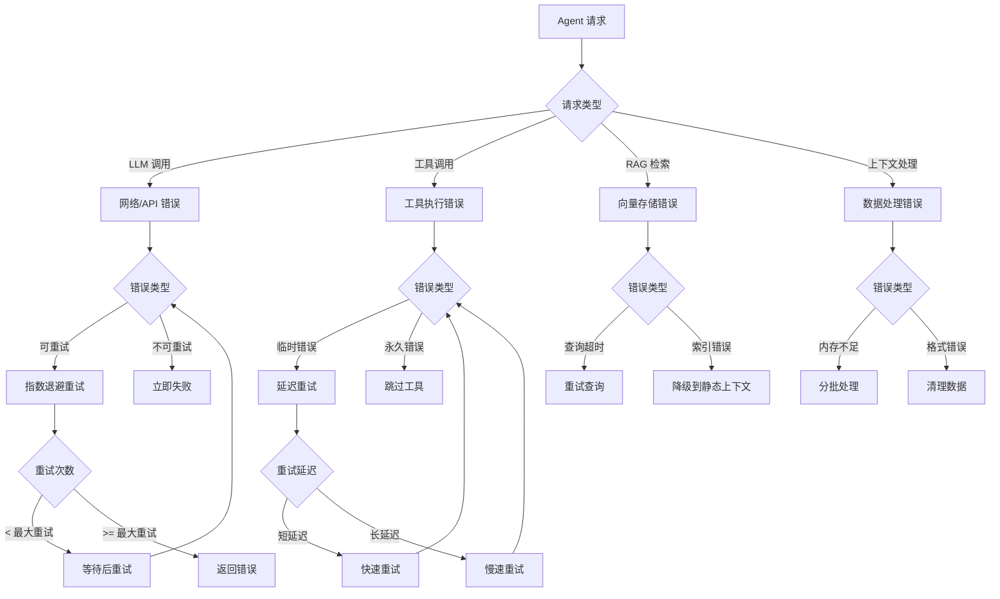
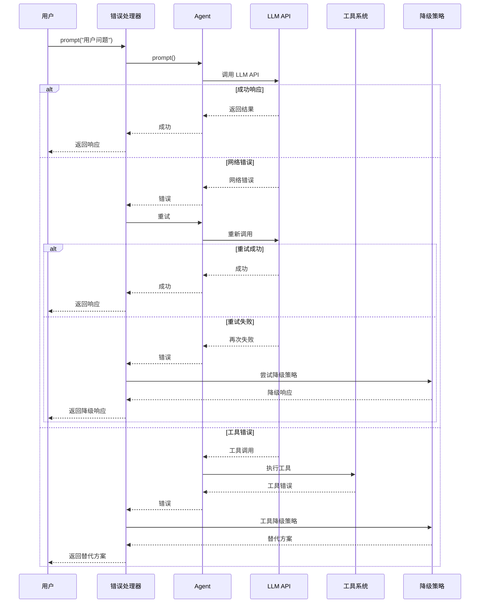

# Rig Agent 执行和协作流程详解

## 概述

Rig 的 Agent 系统是一个强大的 LLM 代理框架，它能够：
- 结合 LLM 模型、系统提示、上下文文档和工具
- 支持静态和动态上下文检索
- 实现多轮对话和工具调用
- 支持 RAG（检索增强生成）工作流
- 提供灵活的配置和扩展能力

## Agent 核心架构

### 1. Agent 结构体

```rust
pub struct Agent<M: CompletionModel> {
    pub name: Option<String>,                    // 代理名称
    pub model: M,                               // 完成模型
    pub preamble: String,                       // 系统提示
    pub static_context: Vec<Document>,          // 静态上下文文档
    pub static_tools: Vec<String>,              // 静态工具名称
    pub temperature: Option<f64>,               // 温度参数
    pub max_tokens: Option<u64>,               // 最大令牌数
    pub additional_params: Option<serde_json::Value>, // 额外参数
    pub dynamic_context: Vec<(usize, Box<dyn VectorStoreIndexDyn>)>, // 动态上下文
    pub dynamic_tools: Vec<(usize, Box<dyn VectorStoreIndexDyn>)>,   // 动态工具
    pub tools: ToolSet,                         // 工具集合
}
```

#### 字段详细说明

**静态上下文 (static_context)**
- **作用**: 存储始终可用的文档内容，这些文档会在每次请求时自动添加到 LLM 的上下文中
- **特点**:
  - 固定不变，不会根据用户查询动态变化
  - 适用于存储 Agent 的核心知识、规则或常用信息
  - 每次请求都会消耗 token，适合存储重要但相对较少的内容
- **使用场景**: 系统规则、常用指令、固定的知识库等

**静态工具 (static_tools)**
- **作用**: 存储工具名称列表，这些工具在每次请求时都可用
- **特点**:
  - 工具名称固定，但工具定义会根据用户查询动态生成
  - 适用于 Agent 的核心功能工具
  - 工具始终可用，不受查询内容影响
- **使用场景**: 计算器、文件操作、API 调用等核心工具

**动态上下文 (dynamic_context)**
- **作用**: 根据用户查询动态检索相关的文档内容
- **特点**:
  - 使用向量搜索根据查询语义找到最相关的文档
  - 每次请求只检索指定数量的相关文档（通过 `usize` 参数控制）
  - 支持 RAG（检索增强生成）工作流
  - 文档内容会根据查询动态变化
- **使用场景**: 知识库检索、文档问答、个性化内容推荐等

**动态工具 (dynamic_tools)**
- **作用**: 根据用户查询动态检索相关的工具
- **特点**:
  - 使用向量搜索找到与查询语义相关的工具
  - 工具选择是动态的，基于查询内容的相关性
  - 支持工具的动态发现和选择
  - 每次检索指定数量的相关工具
- **使用场景**: 插件系统、动态工具发现、基于上下文的工具选择等

**工具集合 (tools)**
- **作用**: 存储所有可用工具的实际实现
- **特点**:
  - 包含工具的完整实现代码
  - 支持两种类型的工具：简单工具和可嵌入工具
  - 提供统一的工具调用接口
  - 管理工具的生命周期和错误处理
- **使用场景**: 工具注册、工具调用、工具管理等

#### 字段协同工作机制

这些字段在 Agent 执行过程中协同工作，形成完整的上下文和工具管理策略：

**1. 上下文管理策略**
- **静态上下文** 提供稳定的基础知识，确保 Agent 始终具备核心能力
- **动态上下文** 根据查询内容智能补充相关信息，实现个性化响应
- 两者结合确保 Agent 既有稳定的知识基础，又能灵活适应不同查询需求

**2. 工具管理策略**
- **静态工具** 确保核心功能始终可用，提供稳定的服务能力
- **动态工具** 根据查询内容智能选择相关工具，实现功能的动态扩展
- **工具集合** 统一管理所有工具，提供一致的调用接口

**3. 执行流程中的协同**
```rust
// 伪代码展示协同工作流程
async fn build_completion_request(&self, prompt: &str) -> CompletionRequest {
    let mut request = self.model.completion_request(prompt);

    // 1. 添加静态上下文（始终包含）
    request.documents(self.static_context.clone());

    // 2. 添加静态工具（始终包含）
    let static_tools = self.get_static_tool_definitions().await;
    request.tools(static_tools);

    // 3. 如果有 RAG 文本，添加动态内容
    if let Some(rag_text) = self.detect_rag_text(prompt) {
        // 动态检索相关文档
        let dynamic_docs = self.retrieve_dynamic_context(rag_text).await;
        request.documents(dynamic_docs);

        // 动态检索相关工具
        let dynamic_tools = self.retrieve_dynamic_tools(rag_text).await;
        request.tools([static_tools, dynamic_tools].concat());
    }

    request
}
```

**4. 实际应用示例**

```rust
// 创建一个智能客服 Agent
let customer_service_agent = openai_client
    .agent(openai::GPT_4O)
    .preamble("你是一个专业的客服代表，负责解答客户问题。")

    // 静态上下文：公司政策、产品信息等固定知识
    .context("我们公司提供7x24小时客户服务")
    .context("产品保修期为2年")
    .context("支持在线和电话两种服务方式")

    // 静态工具：核心服务工具
    .tool(OrderLookupTool)
    .tool(RefundTool)
    .tool(TechnicalSupportTool)

    // 动态上下文：根据客户问题检索相关文档
    .dynamic_context(3, knowledge_base_index)

    // 动态工具：根据问题类型选择专业工具
    .dynamic_tools(2, specialized_tools_index)

    .build();
```

在这个例子中：
- **静态上下文** 确保 Agent 始终了解基本的公司政策和服务信息
- **静态工具** 提供核心的客户服务功能
- **动态上下文** 根据客户具体问题检索相关的产品手册、FAQ 等文档
- **动态工具** 根据问题类型选择相应的专业工具（如技术问题选择技术工具，退款问题选择财务工具）

#### RAG 与非 RAG 场景的行为差异

**非 RAG 场景（无动态内容）**
```rust
// 当用户查询不包含 RAG 文本时
let response = agent.prompt("你好，请介绍一下你们的服务").await?;
// 此时只使用：
// - 静态上下文：公司政策、服务信息
// - 静态工具：核心服务工具
// - 不进行向量搜索
```

**RAG 场景（有动态内容）**
```rust
// 当用户查询包含 RAG 文本时
let response = agent.prompt("我的订单 #12345 有什么问题？").await?;
// 此时会：
// 1. 检测到 RAG 文本（订单号）
// 2. 使用向量搜索检索相关文档
// 3. 动态选择相关工具
// 4. 结合静态和动态内容生成响应
```

**性能考虑**
- **静态内容**: 每次请求都会消耗 token，适合存储重要但较少的内容
- **动态内容**: 只在需要时检索，可以存储大量文档，但会增加延迟
- **工具选择**: 静态工具确保核心功能可用，动态工具提供扩展能力

### 2. Agent 构建器模式

```rust
pub struct AgentBuilder<M: CompletionModel> {
    name: Option<String>,
    model: M,
    preamble: Option<String>,
    static_context: Vec<Document>,
    static_tools: Vec<String>,
    dynamic_context: Vec<(usize, Box<dyn VectorStoreIndexDyn>)>,
    dynamic_tools: Vec<(usize, Box<dyn VectorStoreIndexDyn>)>,
    tools: ToolSet,
    temperature: Option<f64>,
    max_tokens: Option<u64>,
    additional_params: Option<serde_json::Value>,
}
```

## Agent 执行流程

### 1. 基本执行流程




### 2. 详细执行时序图



### 3. 工具调用流程



## Agent 协作模式

### 1. 多 Agent 协作架构



### 2. Agent 链式调用



## 实际使用示例

### 1. 基础 Agent 创建

```rust
use rig::prelude::*;
use rig::providers::openai;

#[tokio::main]
async fn main() -> Result<(), anyhow::Error> {
    // 创建 OpenAI 客户端
    let openai_client = openai::Client::from_env();

    // 创建基础 Agent
    let agent = openai_client
        .agent(openai::GPT_4O)
        .preamble("你是一个友好的AI助手，专门帮助用户解决问题。")
        .temperature(0.7)
        .max_tokens(1024)
        .build();

    // 使用 Agent
    let response = agent.prompt("你好，请介绍一下你自己").await?;
    println!("Agent 响应: {}", response);

    Ok(())
}
```

### 2. 带工具的 Agent

```rust
use rig::prelude::*;
use rig::tool::Tool;
use serde::{Deserialize, Serialize};

// 定义工具参数
#[derive(Deserialize)]
struct CalculatorArgs {
    operation: String,
    a: f64,
    b: f64,
}

// 定义工具输出
#[derive(Serialize)]
struct CalculatorResult {
    result: f64,
    operation: String,
}

// 实现计算器工具
#[derive(Serialize)]
struct Calculator;

impl Tool for Calculator {
    const NAME: &'static str = "calculator";
    type Error = anyhow::Error;
    type Args = CalculatorArgs;
    type Output = CalculatorResult;

    async fn definition(&self, _prompt: String) -> ToolDefinition {
        ToolDefinition {
            name: "calculator".to_string(),
            description: "执行基本的数学运算".to_string(),
            parameters: serde_json::json!({
                "type": "object",
                "properties": {
                    "operation": {
                        "type": "string",
                        "enum": ["add", "subtract", "multiply", "divide"],
                        "description": "要执行的运算"
                    },
                    "a": {
                        "type": "number",
                        "description": "第一个数字"
                    },
                    "b": {
                        "type": "number",
                        "description": "第二个数字"
                    }
                },
                "required": ["operation", "a", "b"]
            })
        }
    }

    async fn call(&self, args: Self::Args) -> Result<Self::Output, Self::Error> {
        let result = match args.operation.as_str() {
            "add" => args.a + args.b,
            "subtract" => args.a - args.b,
            "multiply" => args.a * args.b,
            "divide" => {
                if args.b == 0.0 {
                    return Err(anyhow::anyhow!("除数不能为零"));
                }
                args.a / args.b
            }
            _ => return Err(anyhow::anyhow!("不支持的运算: {}", args.operation)),
        };

        Ok(CalculatorResult {
            result,
            operation: args.operation,
        })
    }
}

#[tokio::main]
async fn main() -> Result<(), anyhow::Error> {
    let openai_client = openai::Client::from_env();

    // 创建带工具的 Agent
    let calculator_agent = openai_client
        .agent(openai::GPT_4O)
        .preamble("你是一个数学助手，可以使用计算器工具来帮助用户进行数学计算。")
        .tool(Calculator)
        .build();

    // 测试工具调用
    let response = calculator_agent
        .prompt("请计算 15 乘以 23 的结果")
        .await?;

    println!("计算结果: {}", response);

    Ok(())
}
```

### 3. RAG Agent 实现

```rust
use rig::prelude::*;
use rig::embeddings::EmbeddingsBuilder;
use rig::vector_store::in_memory_store::InMemoryVectorStore;

#[derive(rig_derive::Embed, Serialize, Clone)]
struct Document {
    id: String,
    #[embed]
    content: String,
    metadata: HashMap<String, String>,
}

#[tokio::main]
async fn main() -> Result<(), anyhow::Error> {
    let openai_client = openai::Client::from_env();
    let embedding_model = openai_client.embedding_model(openai::TEXT_EMBEDDING_ADA_002);

    // 创建向量存储
    let mut vector_store = InMemoryVectorStore::default();

    // 准备文档
    let documents = vec![
        Document {
            id: "doc1".to_string(),
            content: "Rust 是一种系统编程语言，专注于安全性、并发性和性能。".to_string(),
            metadata: HashMap::new(),
        },
        Document {
            id: "doc2".to_string(),
            content: "Rig 是一个用 Rust 编写的 LLM 应用开发库。".to_string(),
            metadata: HashMap::new(),
        },
    ];

    // 生成嵌入向量
    let embeddings = EmbeddingsBuilder::new(embedding_model.clone())
        .documents(documents)?
        .build()
        .await?;

    // 添加到向量存储
    vector_store.add_documents(embeddings).await?;

    // 创建向量索引
    let index = vector_store.index(embedding_model);

    // 创建 RAG Agent
    let rag_agent = openai_client
        .agent(openai::GPT_4O)
        .preamble("你是一个知识助手，基于提供的文档来回答问题。")
        .dynamic_context(2, index) // 每次检索 2 个相关文档
        .build();

    // 测试 RAG 功能
    let response = rag_agent
        .prompt("请介绍一下 Rust 语言的特点")
        .await?;

    println!("RAG 响应: {}", response);

    Ok(())
}
```

### 4. 多 Agent 协作系统

```rust
use rig::prelude::*;
use rig::completion::{Chat, Message, PromptError};

// 多 Agent 协作系统
struct MultiAgentSystem<M: CompletionModel> {
    coordinator: Agent<M>,      // 协调者 Agent
    translator: Agent<M>,       // 翻译 Agent
    calculator: Agent<M>,       // 计算 Agent
    summarizer: Agent<M>,       // 总结 Agent
}
impl<M: CompletionModel> MultiAgentSystem<M> {
    fn new(model: M) -> Self {
        Self {
            coordinator: AgentBuilder::new(model.clone())
                .preamble("“”
                你是任务协调者，负责分析用户需求并分配任务给合适的专家。
                - 当需要进行各种计算的时候或者逻辑处理的时候请选择 计算 专家。
                - 当内容中包含其他非中文的语言内容和描述的时候请交由 翻译 专家将内容翻译成中文。
                - 当用户提出的需求都执行完毕后，再最终返回内容给用户之前请最终交由 总结 专家进行总结之后输出。

                输出格式应明确指出需要哪些专家（例如：计算、翻译、总结）。

                “”")
                .build(),

            translator: AgentBuilder::new(model.clone())
                .preamble("你是翻译专家，负责将文本翻译成英文。")
                .build(),

            calculator: AgentBuilder::new(model.clone())
                .preamble("你是数学专家，负责执行数学计算。")
                .tool(Calculator) // 假设已定义
                .build(),

            summarizer: AgentBuilder::new(model)
                .preamble("你是总结专家，负责将复杂信息总结成简洁的要点。")
                .build(),
        }
    }
}

impl<M: CompletionModel> Chat for MultiAgentSystem<M> {
    async fn chat(
        &self,
        prompt: impl Into<Message> + Send,
        _chat_history: Vec<Message>,
    ) -> Result<String, PromptError> {
        let prompt = prompt.into();
        let prompt_text = prompt.text_content().unwrap_or_default();

        // 1. 协调者分析任务
        let task_analysis = self.coordinator
            .prompt(format!("分析以下任务，确定需要哪些专家参与：{}", prompt_text))
            .await?;

        // 2. 根据 task_analysis 动态分配
        let mut intermediate = prompt_text.clone();

        if task_analysis.contains("计算") {
            intermediate = self.calculator.prompt(&intermediate).await?;
        }

        if task_analysis.contains("翻译") {
            intermediate = self.translator.prompt(&intermediate).await?;
        }

        if task_analysis.contains("总结") {
            intermediate = self.summarizer.prompt(&intermediate).await?;
        }

        // 3. 返回最终结果
        Ok(intermediate)
    }
}

#[tokio::main]
async fn main() -> Result<(), anyhow::Error> {
    let openai_client = openai::Client::from_env();
    let model = openai_client.completion_model(openai::GPT_4O);

    let multi_agent = MultiAgentSystem::new(model);

    // 测试：需要“先计算 → 再翻译”
    let response = multi_agent
        .chat("请帮我计算 25 的平方根，并将结果翻译成英文", vec![])
        .await?;

    println!("多 Agent 协作结果: {}", response);

    Ok(())
}
```

## Agent 配置和优化

### 1. 性能优化配置

```rust
let optimized_agent = openai_client
    .agent(openai::GPT_4O)
    .preamble("你是一个高效的AI助手。")
    .temperature(0.3)           // 降低随机性，提高一致性
    .max_tokens(512)            // 限制响应长度
    .additional_params(json!({
        "top_p": 0.9,           // 控制词汇多样性
        "frequency_penalty": 0.1, // 减少重复
        "presence_penalty": 0.1   // 鼓励新话题
    }))
    .build();
```

### 2. 错误处理和重试

Agent 系统中的错误处理和重试机制是确保系统稳定性和可靠性的关键组件。错误可能发生在多个层面，需要针对性的处理策略。

#### 错误类型和发生时机

**1. 网络层面错误**
- **连接超时**: LLM API 服务不可达
- **请求超时**: API 响应时间过长
- **网络中断**: 网络连接不稳定
- **适用场景**: 所有外部 API 调用

**2. API 层面错误**
- **认证失败**: API Key 无效或过期
- **配额超限**: 达到 API 调用限制
- **服务错误**: LLM 服务内部错误
- **适用场景**: LLM 模型调用、工具 API 调用

**3. 业务层面错误**
- **工具执行失败**: 工具内部逻辑错误
- **上下文检索失败**: 向量存储查询失败
- **参数验证失败**: 输入参数不符合要求
- **适用场景**: 工具调用、RAG 检索、参数处理

**4. 系统层面错误**
- **内存不足**: 处理大量文档时内存溢出
- **并发限制**: 同时处理过多请求
- **资源耗尽**: 文件句柄、数据库连接等资源不足
- **适用场景**: 高并发场景、大规模数据处理

#### 重试策略和适用场景



#### 详细重试实现

**1. 基础重试机制**

```rust
use tokio::time::{sleep, Duration};
use std::time::Instant;

#[derive(Debug, Clone)]
pub struct RetryConfig {
    pub max_retries: u32,
    pub base_delay: Duration,
    pub max_delay: Duration,
    pub backoff_multiplier: f64,
    pub jitter: bool,
}

impl Default for RetryConfig {
    fn default() -> Self {
        Self {
            max_retries: 3,
            base_delay: Duration::from_secs(1),
            max_delay: Duration::from_secs(60),
            backoff_multiplier: 2.0,
            jitter: true,
        }
    }
}

pub struct RetryableAgent<M: CompletionModel> {
    agent: Agent<M>,
    config: RetryConfig,
}

impl<M: CompletionModel> RetryableAgent<M> {
    pub fn new(agent: Agent<M>, config: RetryConfig) -> Self {
        Self { agent, config }
    }

    pub async fn prompt_with_retry(&self, prompt: &str) -> Result<String, anyhow::Error> {
        let mut attempt = 0;
        let start_time = Instant::now();

        loop {
            match self.agent.prompt(prompt).await {
                Ok(response) => {
                    if attempt > 0 {
                        tracing::info!(
                            "Agent 调用成功，第 {} 次尝试，总耗时: {:?}",
                            attempt + 1,
                            start_time.elapsed()
                        );
                    }
                    return Ok(response);
                }
                Err(e) => {
                    attempt += 1;

                    // 判断是否应该重试
                    if !self.should_retry(&e, attempt) {
                        return Err(anyhow::anyhow!("Agent 调用失败，不进行重试: {}", e));
                    }

                    if attempt > self.config.max_retries {
                        return Err(anyhow::anyhow!(
                            "Agent 调用失败，已重试 {} 次，总耗时: {:?}: {}",
                            self.config.max_retries,
                            start_time.elapsed(),
                            e
                        ));
                    }

                    // 计算重试延迟
                    let delay = self.calculate_delay(attempt);

                    tracing::warn!(
                        "Agent 调用失败，第 {} 次重试，等待 {:?}: {}",
                        attempt,
                        delay,
                        e
                    );

                    sleep(delay).await;
                }
            }
        }
    }

    fn should_retry(&self, error: &anyhow::Error, attempt: u32) -> bool {
        // 根据错误类型和重试次数判断是否应该重试
        let error_str = error.to_string().to_lowercase();

        // 网络相关错误通常可以重试
        if error_str.contains("timeout") ||
           error_str.contains("connection") ||
           error_str.contains("network") {
            return true;
        }

        // API 配额错误可以重试
        if error_str.contains("quota") || error_str.contains("rate limit") {
            return true;
        }

        // 服务错误可以重试
        if error_str.contains("internal server error") ||
           error_str.contains("service unavailable") {
            return true;
        }

        // 认证错误不应该重试
        if error_str.contains("unauthorized") ||
           error_str.contains("invalid api key") {
            return false;
        }

        // 参数错误不应该重试
        if error_str.contains("invalid parameter") ||
           error_str.contains("bad request") {
            return false;
        }

        // 默认情况下，前几次尝试可以重试
        attempt < 2
    }

    fn calculate_delay(&self, attempt: u32) -> Duration {
        let mut delay = self.config.base_delay;

        // 指数退避
        for _ in 0..attempt {
            delay = Duration::from_secs_f64(
                delay.as_secs_f64() * self.config.backoff_multiplier
            );
        }

        // 限制最大延迟
        if delay > self.config.max_delay {
            delay = self.config.max_delay;
        }

        // 添加随机抖动
        if self.config.jitter {
            let jitter = rand::random::<f64>() * 0.1; // 10% 的随机抖动
            delay = Duration::from_secs_f64(delay.as_secs_f64() * (1.0 + jitter));
        }

        delay
    }
}
```

**2. 分层错误处理**

```rust
use rig::completion::{PromptError, CompletionError};
use rig::tool::ToolSetError;
use rig::vector_store::VectorStoreError;

pub struct LayeredErrorHandler<M: CompletionModel> {
    agent: Agent<M>,
    retry_config: RetryConfig,
    fallback_strategies: Vec<Box<dyn FallbackStrategy>>,
}

#[async_trait::async_trait]
pub trait FallbackStrategy: Send + Sync {
    async fn can_handle(&self, error: &anyhow::Error) -> bool;
    async fn handle(&self, context: &str) -> Result<String, anyhow::Error>;
}

// 网络错误降级策略
pub struct NetworkFallbackStrategy {
    cache: std::collections::HashMap<String, String>,
}

#[async_trait::async_trait]
impl FallbackStrategy for NetworkFallbackStrategy {
    async fn can_handle(&self, error: &anyhow::Error) -> bool {
        let error_str = error.to_string().to_lowercase();
        error_str.contains("network") || error_str.contains("timeout")
    }

    async fn handle(&self, context: &str) -> Result<String, anyhow::Error> {
        // 从缓存返回之前的响应
        if let Some(cached_response) = self.cache.get(context) {
            return Ok(cached_response.clone());
        }

        // 返回默认响应
        Ok("由于网络问题，暂时无法提供完整服务。请稍后重试。".to_string())
    }
}

// 工具错误降级策略
pub struct ToolFallbackStrategy;

#[async_trait::async_trait]
impl FallbackStrategy for ToolFallbackStrategy {
    async fn can_handle(&self, error: &anyhow::Error) -> bool {
        let error_str = error.to_string().to_lowercase();
        error_str.contains("tool") || error_str.contains("function")
    }

    async fn handle(&self, context: &str) -> Result<String, anyhow::Error> {
        // 提供工具不可用时的替代方案
        Ok(format!("工具暂时不可用，但基于上下文我可以提供以下信息：{}", context))
    }
}

impl<M: CompletionModel> LayeredErrorHandler<M> {
    pub async fn prompt_with_fallback(&self, prompt: &str) -> Result<String, anyhow::Error> {
        // 首先尝试正常调用
        match self.agent.prompt(prompt).await {
            Ok(response) => Ok(response),
            Err(e) => {
                // 尝试重试
                let retryable_agent = RetryableAgent::new(self.agent.clone(), self.retry_config.clone());
                match retryable_agent.prompt_with_retry(prompt).await {
                    Ok(response) => Ok(response),
                    Err(_) => {
                        // 重试失败，尝试降级策略
                        self.try_fallback_strategies(prompt, &e).await
                    }
                }
            }
        }
    }

    async fn try_fallback_strategies(&self, prompt: &str, error: &anyhow::Error) -> Result<String, anyhow::Error> {
        for strategy in &self.fallback_strategies {
            if strategy.can_handle(error).await {
                match strategy.handle(prompt).await {
                    Ok(response) => {
                        tracing::info!("使用降级策略成功处理请求");
                        return Ok(response);
                    }
                    Err(e) => {
                        tracing::warn!("降级策略处理失败: {}", e);
                        continue;
                    }
                }
            }
        }

        // 所有策略都失败，返回原始错误
        Err(anyhow::anyhow!("所有错误处理策略都失败: {}", error))
    }
}
```

**3. 错误处理时序图**



**4. 实际使用示例**

```rust
#[tokio::main]
async fn main() -> Result<(), anyhow::Error> {
    let openai_client = openai::Client::from_env();

    // 创建基础 Agent
    let agent = openai_client
        .agent(openai::GPT_4O)
        .preamble("你是一个可靠的AI助手。")
        .build();

    // 配置重试策略
    let retry_config = RetryConfig {
        max_retries: 5,
        base_delay: Duration::from_secs(2),
        max_delay: Duration::from_secs(30),
        backoff_multiplier: 1.5,
        jitter: true,
    };

    // 创建带错误处理的 Agent
    let robust_agent = RetryableAgent::new(agent, retry_config);

    // 使用重试机制
    let response = robust_agent
        .prompt_with_retry("请介绍一下 Rust 语言的特点")
        .await?;

    println!("响应: {}", response);

    // 创建分层错误处理器
    let mut fallback_strategies: Vec<Box<dyn FallbackStrategy>> = vec![
        Box::new(NetworkFallbackStrategy {
            cache: std::collections::HashMap::new(),
        }),
        Box::new(ToolFallbackStrategy),
    ];

    let layered_handler = LayeredErrorHandler {
        agent: openai_client.agent(openai::GPT_4O).build(),
        retry_config,
        fallback_strategies,
    };

    // 使用分层错误处理
    let response = layered_handler
        .prompt_with_fallback("请帮我计算复杂的数学问题")
        .await?;

    println!("最终响应: {}", response);

    Ok(())
}
```

**5. 错误监控和日志**

```rust
use tracing::{info, warn, error, instrument};
use metrics::{counter, histogram, gauge};

#[instrument(skip(self))]
pub async fn prompt_with_monitoring(&self, prompt: &str) -> Result<String, anyhow::Error> {
    let start_time = Instant::now();

    // 记录请求开始
    counter!("agent_requests_total", 1);
    gauge!("agent_requests_active", 1);

    let result = self.agent.prompt(prompt).await;

    // 记录请求完成
    let duration = start_time.elapsed();
    histogram!("agent_request_duration_seconds", duration.as_secs_f64());
    gauge!("agent_requests_active", -1);

    match &result {
        Ok(_) => {
            counter!("agent_requests_success", 1);
            info!("Agent 请求成功，耗时: {:?}", duration);
        }
        Err(e) => {
            counter!("agent_requests_failed", 1);
            error!("Agent 请求失败，耗时: {:?}, 错误: {}", duration, e);
        }
    }

    result
}
```

## 总结

Rig 的 Agent 系统提供了：

1. **灵活的配置**: 通过 Builder 模式轻松配置各种参数
2. **强大的工具集成**: 支持静态和动态工具管理
3. **智能上下文管理**: 结合静态和动态上下文检索
4. **多轮对话支持**: 自动处理工具调用和对话历史
5. **RAG 能力**: 集成向量存储实现检索增强生成
6. **协作模式**: 支持多个 Agent 协同工作
7. **异步执行**: 全面支持 async/await 模式

这种设计使得开发者能够快速构建复杂的 AI 应用，从简单的聊天机器人到复杂的多 Agent 协作系统，都能通过 Rig 的 Agent 框架实现。
