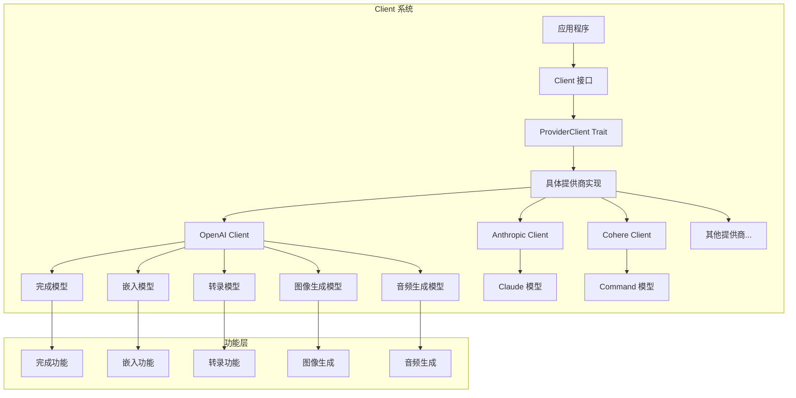
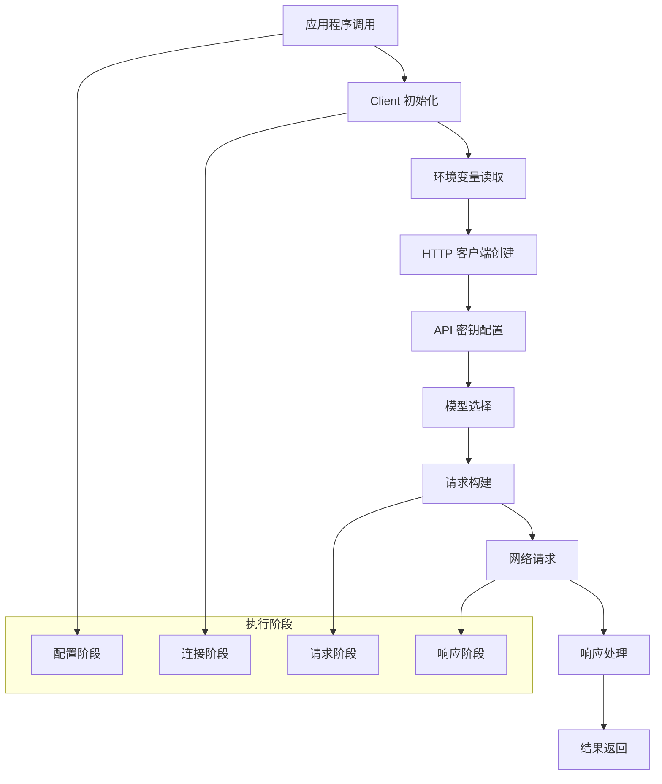
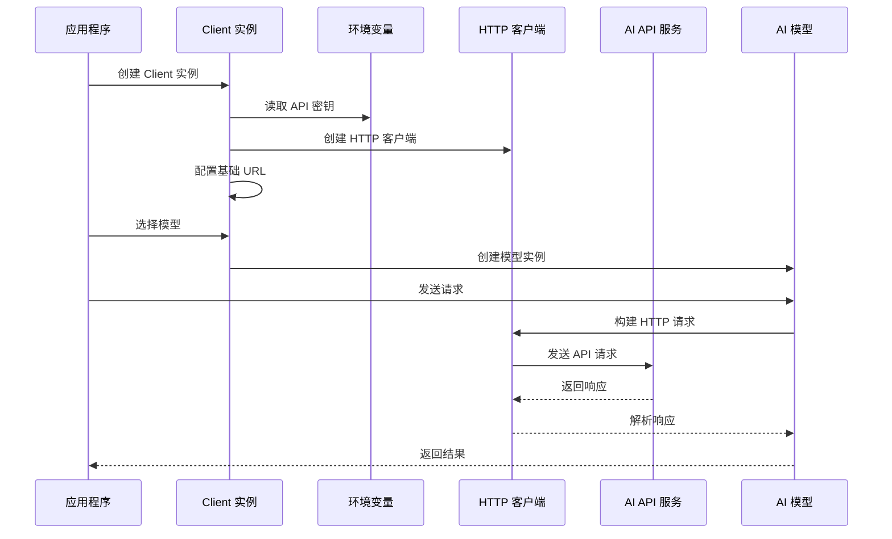
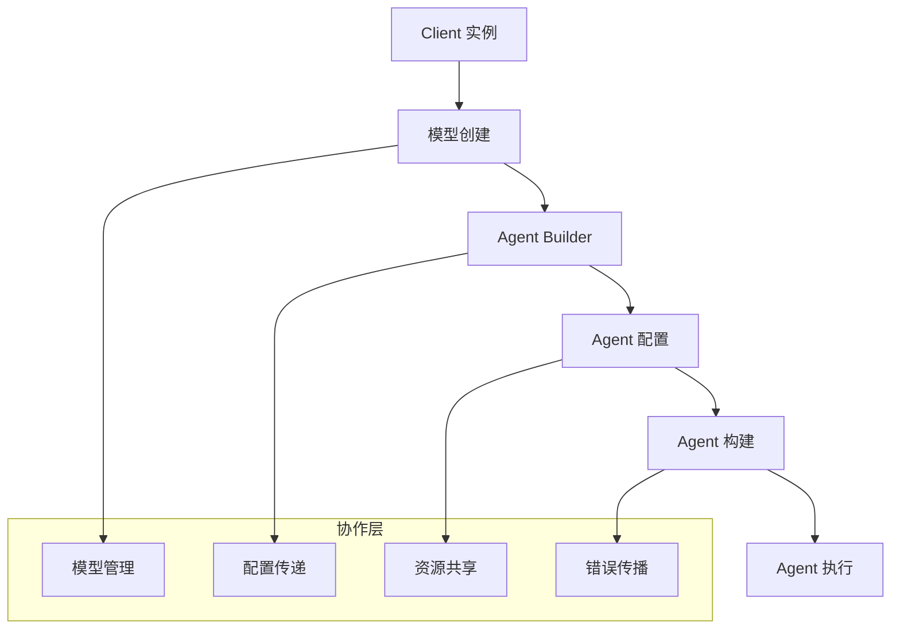
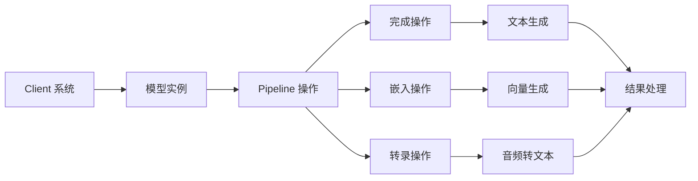
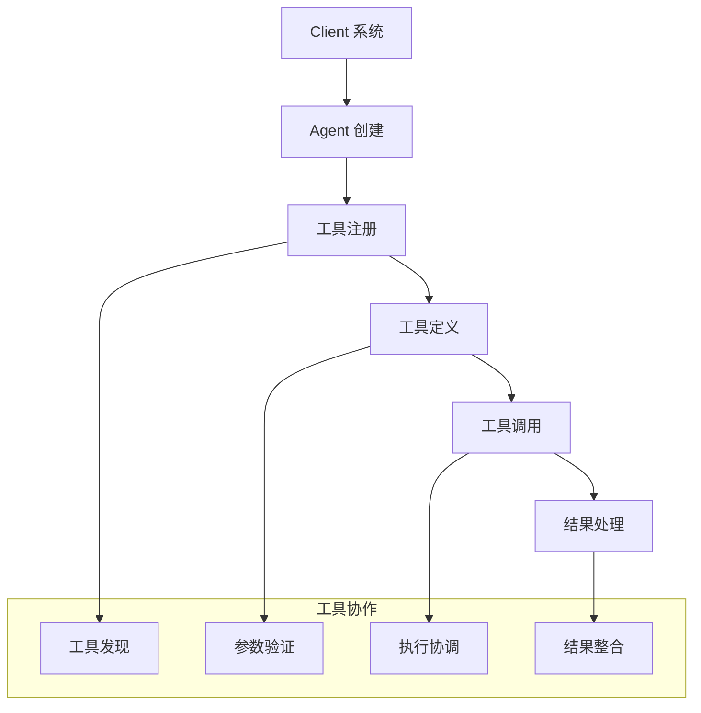

# Rig Client 执行和协作流程详解

## 概述

Rig Client 系统是 Rig 库的核心组件，负责管理与各种 LLM 提供商的连接和交互。Client 系统提供了统一的接口来访问不同的 AI 服务，包括完成、嵌入、转录、图像生成和音频生成等功能。它通过抽象层实现了提供商无关的代码编写，同时保持了类型安全和性能。

## Client 核心概念

### 1. 基本架构



### 2. 核心组件

**ProviderClient Trait**: 所有提供商客户端的基础接口
```rust
pub trait ProviderClient:
    AsCompletion + AsTranscription + AsEmbeddings + AsImageGeneration + AsAudioGeneration + Debug
{
    fn from_env() -> Self where Self: Sized;
    fn boxed(self) -> Box<dyn ProviderClient> where Self: Sized + 'static;
    fn from_val(input: ProviderValue) -> Self where Self: Sized;
}
```

**功能特化 Traits**: 针对不同 AI 功能的专门接口
```rust
pub trait CompletionClient: ProviderClient + Clone {
    type CompletionModel: CompletionModel;
    fn completion_model(&self, model: &str) -> Self::CompletionModel;
    fn agent(&self, model: &str) -> AgentBuilder<Self::CompletionModel>;
}

pub trait EmbeddingsClient: ProviderClient + Clone {
    type EmbeddingModel: EmbeddingModel;
    fn embedding_model(&self, model: &str) -> Self::EmbeddingModel;
}
```

**动态客户端构建器**: 支持运行时选择提供商
```rust
pub struct DynClientBuilder {
    registry: HashMap<String, ClientFactory>,
}
```

## Client 执行流程

### 1. 基本执行流程



### 2. 详细执行时序图



### 3. 客户端生命周期图

```mermaid
flowchart LR
    A[Client 创建] --> B[配置初始化]
    B --> C[功能模型创建]
    C --> D[请求处理]
    D --> E[响应返回]
    E --> F[资源清理]

    subgraph "生命周期管理"
        G[内存管理]
        H[连接池]
        I[错误处理]
        J[重试机制]
    end

    B --> G
    C --> H
    D --> I
    E --> J

## Client 类型和实现

### 1. 基础客户端结构

**OpenAI Client 实现**:
```rust
#[derive(Clone)]
pub struct Client {
    base_url: String,
    api_key: String,
    http_client: reqwest::Client,
}

impl Client {
    pub fn new(api_key: &str) -> Self {
        Self::builder(api_key)
            .build()
            .expect("OpenAI client should build")
    }

    pub fn builder(api_key: &str) -> ClientBuilder<'_> {
        ClientBuilder::new(api_key)
    }

    pub(crate) fn post(&self, path: &str) -> reqwest::RequestBuilder {
        let url = format!("{}/{}", self.base_url, path).replace("//", "/");
        self.http_client.post(url).bearer_auth(&self.api_key)
    }
}
```

**Client Builder 模式**:
```rust
pub struct ClientBuilder<'a> {
    api_key: &'a str,
    base_url: &'a str,
    http_client: Option<reqwest::Client>,
}

impl<'a> ClientBuilder<'a> {
    pub fn new(api_key: &'a str) -> Self {
        Self {
            api_key,
            base_url: OPENAI_API_BASE_URL,
            http_client: None,
        }
    }

    pub fn base_url(mut self, base_url: &'a str) -> Self {
        self.base_url = base_url;
        self
    }

    pub fn custom_client(mut self, client: reqwest::Client) -> Self {
        self.http_client = Some(client);
        self
    }

    pub fn build(self) -> Result<Client, ClientBuilderError> {
        let http_client = if let Some(http_client) = self.http_client {
            http_client
        } else {
            reqwest::Client::builder().build()?
        };

        Ok(Client {
            base_url: self.base_url.to_string(),
            api_key: self.api_key.to_string(),
            http_client,
        })
    }
}
```

### 2. 功能特化实现

**完成功能实现**:
```rust
impl CompletionClient for Client {
    type CompletionModel = super::responses_api::ResponsesCompletionModel;

    fn completion_model(&self, model: &str) -> Self::CompletionModel {
        super::responses_api::ResponsesCompletionModel::new(self.clone(), model)
    }
}
```

**嵌入功能实现**:
```rust
impl EmbeddingsClient for Client {
    type EmbeddingModel = EmbeddingModel;

    fn embedding_model(&self, model: &str) -> Self::EmbeddingModel {
        let ndims = match model {
            TEXT_EMBEDDING_3_LARGE => 3072,
            TEXT_EMBEDDING_3_SMALL | TEXT_EMBEDDING_ADA_002 => 1536,
            _ => 0,
        };
        EmbeddingModel::new(self.clone(), model, ndims)
    }

    fn embedding_model_with_ndims(&self, model: &str, ndims: usize) -> Self::EmbeddingModel {
        EmbeddingModel::new(self.clone(), model, ndims)
    }
}
```

**转录功能实现**:
```rust
impl TranscriptionClient for Client {
    type TranscriptionModel = TranscriptionModel;

    fn transcription_model(&self, model: &str) -> Self::TranscriptionModel {
        TranscriptionModel::new(self.clone(), model)
    }
}
```

### 3. 动态客户端系统

**DynClientBuilder 结构**:
```rust
pub struct DynClientBuilder {
    registry: HashMap<String, ClientFactory>,
}

impl DynClientBuilder {
    pub fn new() -> Self {
        Self {
            registry: HashMap::new(),
        }
        .register_all(vec![
            ClientFactory::new(
                DefaultProviders::ANTHROPIC,
                anthropic::Client::from_env_boxed,
                anthropic::Client::from_val_boxed,
            ),
            ClientFactory::new(
                DefaultProviders::OPENAI,
                openai::Client::from_env_boxed,
                openai::Client::from_val_boxed,
            ),
            // ... 其他提供商
        ])
    }

    pub fn completion(
        &self,
        provider: &str,
        model: &str,
    ) -> Result<BoxCompletionModel<'a>, ClientBuildError> {
        let client = self.build(provider)?;
        let completion = client
            .as_completion()
            .ok_or(ClientBuildError::UnsupportedFeature(
                provider.to_string(),
                "completion".to_owned(),
            ))?;
        Ok(completion.completion_model(model))
    }

    pub fn agent(
        &self,
        provider: &str,
        model: &str,
    ) -> Result<BoxAgentBuilder<'a>, ClientBuildError> {
        let client = self.build(provider)?;
        let client = client
            .as_completion()
            .ok_or(ClientBuildError::UnsupportedFeature(
                provider.to_string(),
                "completion".to_string(),
            ))?;
        Ok(client.agent(model))
    }
}
```

**ClientFactory 实现**:
```rust
pub struct ClientFactory {
    pub name: String,
    pub factory_env: Box<dyn Fn() -> Box<dyn ProviderClient>>,
    pub factory_val: Box<dyn Fn(ProviderValue) -> Box<dyn ProviderClient>>,
}

impl ClientFactory {
    pub fn new<F1, F2>(name: &str, func_env: F1, func_val: F2) -> Self
    where
        F1: 'static + Fn() -> Box<dyn ProviderClient>,
        F2: 'static + Fn(ProviderValue) -> Box<dyn ProviderClient>,
    {
        Self {
            name: name.to_string(),
            factory_env: Box::new(func_env),
            factory_val: Box::new(func_val),
        }
    }

    pub fn build(&self) -> Result<Box<dyn ProviderClient>, ClientBuildError> {
        std::panic::catch_unwind(|| (self.factory_env)())
            .map_err(|e| ClientBuildError::FactoryError(format!("{e:?}")))
    }

    pub fn build_from_val(
        &self,
        val: ProviderValue,
    ) -> Result<Box<dyn ProviderClient>, ClientBuildError> {
        std::panic::catch_unwind(|| (self.factory_val)(val))
            .map_err(|e| ClientBuildError::FactoryError(format!("{e:?}")))
    }
}
```

## Client 协作模式

### 1. 与 Agent 系统协作



### 2. 与 Pipeline 系统协作



### 3. 与 Tools 系统协作



### 4. 与 Vector Store 协作

```mermaid
flowchart LR
    A[Client 系统] --> B[嵌入模型]
    B --> C[文本嵌入]
    C --> D[向量生成]
    D --> E[向量存储]
    E --> F[相似性搜索]

    F --> G[检索结果]
    G --> H[上下文构建]
    H --> I[Agent 使用]

## 实际使用示例

### 1. 基础 Client 使用

**直接使用 OpenAI Client**:
```rust
use rig::providers::openai::Client;

#[tokio::main]
async fn main() -> Result<(), anyhow::Error> {
    // 从环境变量创建客户端
    let client = Client::from_env();

    // 创建完成模型
    let model = client.completion_model("gpt-4o");

    // 创建 Agent
    let agent = client
        .agent("gpt-4o")
        .preamble("You are a helpful assistant")
        .build();

    // 发送提示
    let response = agent.prompt("Hello world!").await?;
    println!("Response: {}", response);

    Ok(())
}
```

**使用 Client Builder**:
```rust
use rig::providers::openai::{Client, ClientBuilder};

#[tokio::main]
async fn main() -> Result<(), anyhow::Error> {
    // 使用 Builder 模式创建客户端
    let client = ClientBuilder::new("your-api-key")
        .base_url("https://api.openai.com/v1")
        .custom_client(reqwest::Client::new())
        .build()?;

    // 创建嵌入模型
    let embedding_model = client.embedding_model("text-embedding-3-small");

    // 生成嵌入
    let embedding = embedding_model.embed_text("Hello world!").await?;
    println!("Embedding dimensions: {}", embedding.vec.len());

    Ok(())
}
```

### 2. 动态客户端使用

**多提供商支持**:
```rust
use rig::client::builder::DynClientBuilder;
use rig::providers::anthropic::CLAUDE_3_7_SONNET;

#[tokio::main]
async fn main() -> Result<(), anyhow::Error> {
    let multi_client = DynClientBuilder::new();

    // 设置 OpenAI 客户端
    let completion_openai = multi_client.agent("openai", "gpt-4o")?;
    let agent_openai = completion_openai
        .preamble("You are a helpful assistant")
        .build();

    // 设置 Anthropic 客户端
    let completion_anthropic = multi_client.agent("anthropic", CLAUDE_3_7_SONNET)?;
    let agent_anthropic = completion_anthropic
        .preamble("You are a helpful assistant")
        .max_tokens(1024)
        .build();

    println!("Sending prompt: 'Hello world!'");

    // 使用 OpenAI
    let res_openai = agent_openai.prompt("Hello world!").await?;
    println!("Response from OpenAI: {}", res_openai);

    // 使用 Anthropic
    let res_anthropic = agent_anthropic.prompt("Hello world!").await?;
    println!("Response from Anthropic: {}", res_anthropic);

    Ok(())
}
```

**运行时提供商选择**:
```rust
use rig::client::builder::DynClientBuilder;

async fn create_agent_for_provider(
    provider: &str,
    model: &str,
) -> Result<Box<dyn rig::completion::Prompt>, anyhow::Error> {
    let client_builder = DynClientBuilder::new();

    let agent_builder = client_builder.agent(provider, model)?;
    let agent = agent_builder
        .preamble("You are a helpful assistant")
        .build();

    Ok(Box::new(agent))
}

#[tokio::main]
async fn main() -> Result<(), anyhow::Error> {
    // 根据配置选择提供商
    let provider = std::env::var("AI_PROVIDER").unwrap_or_else(|_| "openai".to_string());
    let model = std::env::var("AI_MODEL").unwrap_or_else(|_| "gpt-4o".to_string());

    let agent = create_agent_for_provider(&provider, &model).await?;
    let response = agent.prompt("Hello world!").await?;

    println!("Response: {}", response);
    Ok(())
}
```

### 3. 多模型协作

**完成和嵌入模型协作**:
```rust
use rig::providers::openai::Client;
use rig::vector_store::InMemoryVectorStore;

#[tokio::main]
async fn main() -> Result<(), anyhow::Error> {
    let client = Client::from_env();

    // 创建完成模型
    let completion_model = client.completion_model("gpt-4o");

    // 创建嵌入模型
    let embedding_model = client.embedding_model("text-embedding-3-small");

    // 创建向量存储
    let mut vector_store = InMemoryVectorStore::new();

    // 添加文档到向量存储
    let documents = vec![
        "Rust is a systems programming language",
        "WebAssembly is a binary instruction format",
        "Machine learning is a subset of AI",
    ];

    for (i, doc) in documents.iter().enumerate() {
        let embedding = embedding_model.embed_text(doc).await?;
        vector_store.insert_documents(vec![(i.to_string(), doc.to_string(), embedding.vec)])?;
    }

    // 创建带动态上下文的 Agent
    let agent = client
        .agent("gpt-4o")
        .preamble("You are a helpful assistant with access to a knowledge base")
        .dynamic_context(3, vector_store)
        .build();

    let response = agent.prompt("What can you tell me about Rust and WebAssembly?").await?;
    println!("Response: {}", response);

    Ok(())
}
```

**转录和完成模型协作**:
```rust
use rig::providers::openai::Client;
use std::fs;

#[tokio::main]
async fn main() -> Result<(), anyhow::Error> {
    let client = Client::from_env();

    // 创建转录模型
    let transcription_model = client.transcription_model("whisper-1");

    // 创建完成模型
    let completion_model = client.completion_model("gpt-4o");

    // 读取音频文件
    let audio_data = fs::read("audio.mp3")?;

    // 转录音频
    let transcription = transcription_model
        .transcription(rig::transcription::TranscriptionRequest {
            data: audio_data,
            filename: "audio.mp3".to_string(),
            language: "en".to_string(),
            prompt: None,
            temperature: None,
            additional_params: None,
        })
        .await?;

    println!("Transcription: {}", transcription.text);

    // 使用转录文本进行完成
    let completion = completion_model
        .completion_request(rig::message::Message::user(&transcription.text))
        .send()
        .await?;

    println!("Analysis: {}", completion.choice[0].text);

    Ok(())
}
```

### 4. 错误处理和重试

**自定义错误处理**:
```rust
use rig::providers::openai::Client;
use rig::client::ClientBuilderError;
use std::time::Duration;
use tokio::time::sleep;

struct ResilientClient {
    client: Client,
    max_retries: u32,
    base_delay: Duration,
}

impl ResilientClient {
    fn new(api_key: &str, max_retries: u32) -> Result<Self, ClientBuilderError> {
        let client = Client::new(api_key);
        Ok(Self {
            client,
            max_retries,
            base_delay: Duration::from_secs(1),
        })
    }

    async fn prompt_with_retry(&self, prompt: &str) -> Result<String, anyhow::Error> {
        let mut last_error = None;

        for attempt in 0..=self.max_retries {
            match self.client
                .agent("gpt-4o")
                .preamble("You are a helpful assistant")
                .build()
                .prompt(prompt)
                .await
            {
                Ok(response) => return Ok(response),
                Err(e) => {
                    last_error = Some(e);

                    if attempt < self.max_retries {
                        let delay = self.base_delay * 2_u32.pow(attempt);
                        println!("Attempt {} failed, retrying in {:?}...", attempt + 1, delay);
                        sleep(delay).await;
                    }
                }
            }
        }

        Err(last_error.unwrap().into())
    }
}

#[tokio::main]
async fn main() -> Result<(), anyhow::Error> {
    let resilient_client = ResilientClient::new("your-api-key", 3)?;

    let response = resilient_client
        .prompt_with_retry("Hello world!")
        .await?;

    println!("Response: {}", response);
    Ok(())
}
```

### 5. 高级配置和自定义

**自定义 HTTP 客户端**:
```rust
use rig::providers::openai::{Client, ClientBuilder};
use reqwest::Client as ReqwestClient;
use std::time::Duration;

#[tokio::main]
async fn main() -> Result<(), anyhow::Error> {
    // 创建自定义 HTTP 客户端
    let http_client = ReqwestClient::builder()
        .timeout(Duration::from_secs(30))
        .pool_max_idle_per_host(10)
        .pool_idle_timeout(Duration::from_secs(90))
        .build()?;

    // 使用自定义客户端创建 OpenAI Client
    let client = ClientBuilder::new("your-api-key")
        .custom_client(http_client)
        .build()?;

    let agent = client
        .agent("gpt-4o")
        .preamble("You are a helpful assistant")
        .build();

    let response = agent.prompt("Hello world!").await?;
    println!("Response: {}", response);

    Ok(())
}
```

**环境变量配置管理**:
```rust
use rig::providers::openai::Client;
use std::collections::HashMap;

struct ClientConfig {
    api_key: String,
    base_url: Option<String>,
    timeout: Option<u64>,
    max_retries: Option<u32>,
}

impl ClientConfig {
    fn from_env() -> Self {
        Self {
            api_key: std::env::var("OPENAI_API_KEY")
                .expect("OPENAI_API_KEY not set"),
            base_url: std::env::var("OPENAI_BASE_URL").ok(),
            timeout: std::env::var("OPENAI_TIMEOUT")
                .ok()
                .and_then(|s| s.parse().ok()),
            max_retries: std::env::var("OPENAI_MAX_RETRIES")
                .ok()
                .and_then(|s| s.parse().ok()),
        }
    }
}

fn create_client_from_config(config: ClientConfig) -> Result<Client, anyhow::Error> {
    let mut builder = ClientBuilder::new(&config.api_key);

    if let Some(base_url) = config.base_url {
        builder = builder.base_url(&base_url);
    }

    if let Some(timeout) = config.timeout {
        let http_client = reqwest::Client::builder()
            .timeout(Duration::from_secs(timeout))
            .build()?;
        builder = builder.custom_client(http_client);
    }

    Ok(builder.build()?)
}

#[tokio::main]
async fn main() -> Result<(), anyhow::Error> {
    let config = ClientConfig::from_env();
    let client = create_client_from_config(config)?;

    let agent = client
        .agent("gpt-4o")
        .preamble("You are a helpful assistant")
        .build();

    let response = agent.prompt("Hello world!").await?;
    println!("Response: {}", response);

    Ok(())
}
```

### 6. 批量处理和并行化

**并行客户端处理**:
```rust
use rig::client::builder::DynClientBuilder;
use tokio::task::JoinSet;
use std::collections::HashMap;

async fn process_with_multiple_providers(
    prompt: &str,
    providers: Vec<(&str, &str)>,
) -> Result<HashMap<String, String>, anyhow::Error> {
    let client_builder = DynClientBuilder::new();
    let mut join_set = JoinSet::new();
    let mut results = HashMap::new();

    // 为每个提供商创建任务
    for (provider, model) in providers {
        let prompt = prompt.to_string();
        let client_builder = client_builder.clone();

        join_set.spawn(async move {
            let agent = client_builder
                .agent(provider, model)?
                .preamble("You are a helpful assistant")
                .build();

            let response = agent.prompt(&prompt).await?;
            Ok::<_, anyhow::Error>((provider.to_string(), response))
        });
    }

    // 等待所有任务完成
    while let Some(result) = join_set.join_next().await {
        let (provider, response) = result??;
        results.insert(provider, response);
    }

    Ok(results)
}

#[tokio::main]
async fn main() -> Result<(), anyhow::Error> {
    let providers = vec![
        ("openai", "gpt-4o"),
        ("anthropic", "claude-3-5-sonnet-20241022"),
        ("cohere", "command-r"),
    ];

    let results = process_with_multiple_providers(
        "What is the capital of France?",
        providers,
    ).await?;

    for (provider, response) in results {
        println!("{}: {}", provider, response);
    }

    Ok(())
}
```

**批量请求处理**:
```rust
use rig::providers::openai::Client;
use futures::stream::{self, StreamExt};
use std::collections::HashMap;

struct BatchProcessor {
    client: Client,
    batch_size: usize,
}

impl BatchProcessor {
    fn new(api_key: &str, batch_size: usize) -> Result<Self, anyhow::Error> {
        let client = Client::new(api_key);
        Ok(Self {
            client,
            batch_size,
        })
    }

    async fn process_batch(
        &self,
        prompts: Vec<String>,
    ) -> Result<Vec<String>, anyhow::Error> {
        let agent = self.client
            .agent("gpt-4o")
            .preamble("You are a helpful assistant")
            .build();

        let mut results = Vec::new();

        // 分批处理请求
        for chunk in prompts.chunks(self.batch_size) {
            let futures: Vec<_> = chunk
                .iter()
                .map(|prompt| agent.prompt(prompt))
                .collect();

            let chunk_results = futures::future::join_all(futures).await;

            for result in chunk_results {
                results.push(result?);
            }
        }

        Ok(results)
    }

    async fn process_embeddings_batch(
        &self,
        texts: Vec<String>,
    ) -> Result<Vec<Vec<f32>>, anyhow::Error> {
        let embedding_model = self.client.embedding_model("text-embedding-3-small");

        let mut embeddings = Vec::new();

        // 分批处理嵌入
        for chunk in texts.chunks(self.batch_size) {
            let chunk_embeddings = embedding_model.embed_texts(chunk.to_vec()).await?;

            for embedding in chunk_embeddings {
                embeddings.push(embedding.vec);
            }
        }

        Ok(embeddings)
    }
}

#[tokio::main]
async fn main() -> Result<(), anyhow::Error> {
    let processor = BatchProcessor::new("your-api-key", 5)?;

    let prompts = vec![
        "What is Rust?",
        "What is WebAssembly?",
        "What is machine learning?",
        "What is artificial intelligence?",
        "What is blockchain?",
    ];

    let responses = processor.process_batch(prompts).await?;

    for (i, response) in responses.iter().enumerate() {
        println!("Prompt {}: {}", i + 1, response);
    }

    Ok(())
}
```

## Client 开发最佳实践

### 1. 错误处理

```rust
use rig::providers::openai::Client;
use rig::client::ClientBuilderError;
use thiserror::Error;

#[derive(Error, Debug)]
pub enum ClientError {
    #[error("Client builder error: {0}")]
    BuilderError(#[from] ClientBuilderError),

    #[error("API request failed: {0}")]
    ApiError(String),

    #[error("Rate limit exceeded, retry after: {0}")]
    RateLimitError(u64),

    #[error("Authentication failed: {0}")]
    AuthError(String),

    #[error("Network error: {0}")]
    NetworkError(String),
}

impl ClientError {
    pub fn is_retryable(&self) -> bool {
        matches!(self,
            ClientError::RateLimitError(_) |
            ClientError::NetworkError(_)
        )
    }

    pub fn retry_after(&self) -> Option<u64> {
        if let ClientError::RateLimitError(seconds) = self {
            Some(*seconds)
        } else {
            None
        }
    }
}

struct RobustClient {
    client: Client,
    max_retries: u32,
}

impl RobustClient {
    fn new(api_key: &str) -> Result<Self, ClientError> {
        let client = Client::new(api_key);
        Ok(Self {
            client,
            max_retries: 3,
        })
    }

    async fn prompt_with_error_handling(
        &self,
        prompt: &str,
    ) -> Result<String, ClientError> {
        let mut last_error = None;

        for attempt in 0..=self.max_retries {
            match self.client
                .agent("gpt-4o")
                .preamble("You are a helpful assistant")
                .build()
                .prompt(prompt)
                .await
            {
                Ok(response) => return Ok(response),
                Err(e) => {
                    last_error = Some(ClientError::ApiError(e.to_string()));

                    if attempt < self.max_retries {
                        if let Some(retry_after) = e.retry_after() {
                            tokio::time::sleep(Duration::from_secs(retry_after)).await;
                        } else {
                            tokio::time::sleep(Duration::from_secs(2_u32.pow(attempt))).await;
                        }
                    }
                }
            }
        }

        Err(last_error.unwrap())
    }
}
```

### 2. 性能优化

```rust
use rig::providers::openai::Client;
use std::sync::Arc;
use tokio::sync::Semaphore;

struct OptimizedClient {
    client: Arc<Client>,
    semaphore: Arc<Semaphore>,
    connection_pool: Arc<reqwest::Client>,
}

impl OptimizedClient {
    fn new(api_key: &str, max_concurrent: usize) -> Result<Self, anyhow::Error> {
        let client = Arc::new(Client::new(api_key));

        let semaphore = Arc::new(Semaphore::new(max_concurrent));

        let connection_pool = Arc::new(
            reqwest::Client::builder()
                .pool_max_idle_per_host(max_concurrent)
                .pool_idle_timeout(Duration::from_secs(90))
                .timeout(Duration::from_secs(30))
                .build()?
        );

        Ok(Self {
            client,
            semaphore,
            connection_pool,
        })
    }

    async fn prompt_with_concurrency_control(
        &self,
        prompt: &str,
    ) -> Result<String, anyhow::Error> {
        let _permit = self.semaphore.acquire().await?;

        let agent = self.client
            .agent("gpt-4o")
            .preamble("You are a helpful assistant")
            .build();

        agent.prompt(prompt).await.map_err(|e| e.into())
    }

    async fn process_concurrent_requests(
        &self,
        prompts: Vec<String>,
    ) -> Result<Vec<String>, anyhow::Error> {
        let futures: Vec<_> = prompts
            .into_iter()
            .map(|prompt| self.prompt_with_concurrency_control(&prompt))
            .collect();

        let results = futures::future::join_all(futures).await;

        results.into_iter().collect()
    }
}
```

### 3. 监控和日志

```rust
use rig::providers::openai::Client;
use tracing::{info, warn, error, instrument};
use std::time::Instant;

struct MonitoredClient {
    client: Client,
    metrics: Arc<ClientMetrics>,
}

#[derive(Default)]
struct ClientMetrics {
    total_requests: std::sync::atomic::AtomicU64,
    successful_requests: std::sync::atomic::AtomicU64,
    failed_requests: std::sync::atomic::AtomicU64,
    total_latency: std::sync::atomic::AtomicU64,
}

impl MonitoredClient {
    fn new(api_key: &str) -> Self {
        Self {
            client: Client::new(api_key),
            metrics: Arc::new(ClientMetrics::default()),
        }
    }

    #[instrument(skip(self))]
    async fn prompt_with_monitoring(
        &self,
        prompt: &str,
    ) -> Result<String, anyhow::Error> {
        let start = Instant::now();

        info!("Starting prompt request", prompt_length = prompt.len());

        self.metrics.total_requests.fetch_add(1, std::sync::atomic::Ordering::Relaxed);

        match self.client
            .agent("gpt-4o")
            .preamble("You are a helpful assistant")
            .build()
            .prompt(prompt)
            .await
        {
            Ok(response) => {
                let latency = start.elapsed();
                let latency_ms = latency.as_millis() as u64;

                self.metrics.successful_requests.fetch_add(1, std::sync::atomic::Ordering::Relaxed);
                self.metrics.total_latency.fetch_add(latency_ms, std::sync::atomic::Ordering::Relaxed);

                info!(
                    "Prompt request completed successfully",
                    latency_ms = latency_ms,
                    response_length = response.len()
                );

                Ok(response)
            }
            Err(e) => {
                self.metrics.failed_requests.fetch_add(1, std::sync::atomic::Ordering::Relaxed);

                error!(
                    "Prompt request failed",
                    error = %e,
                    prompt_length = prompt.len()
                );

                Err(e.into())
            }
        }
    }

    fn get_metrics(&self) -> ClientMetricsSnapshot {
        let total = self.metrics.total_requests.load(std::sync::atomic::Ordering::Relaxed);
        let successful = self.metrics.successful_requests.load(std::sync::atomic::Ordering::Relaxed);
        let failed = self.metrics.failed_requests.load(std::sync::atomic::Ordering::Relaxed);
        let total_latency = self.metrics.total_latency.load(std::sync::atomic::Ordering::Relaxed);

        let success_rate = if total > 0 {
            successful as f64 / total as f64
        } else {
            0.0
        };

        let avg_latency = if successful > 0 {
            total_latency as f64 / successful as f64
        } else {
            0.0
        };

        ClientMetricsSnapshot {
            total_requests: total,
            successful_requests: successful,
            failed_requests: failed,
            success_rate,
            average_latency_ms: avg_latency,
        }
    }
}

#[derive(Debug)]
struct ClientMetricsSnapshot {
    total_requests: u64,
    successful_requests: u64,
    failed_requests: u64,
    success_rate: f64,
    average_latency_ms: f64,
}
```

## 总结

Rig Client 系统提供了：

1. **统一的提供商接口**: 通过 `ProviderClient` trait 实现提供商无关的代码编写
2. **功能特化支持**: 针对完成、嵌入、转录、图像生成、音频生成等功能的专门接口
3. **动态客户端构建**: 支持运行时选择和配置不同的 AI 提供商
4. **类型安全**: 编译时类型检查，减少运行时错误
5. **灵活配置**: 支持环境变量、自定义 HTTP 客户端、超时设置等
6. **错误处理**: 完善的错误类型和重试机制
7. **性能优化**: 连接池、并发控制、批量处理等优化特性

这种设计使得开发者能够：

- 轻松切换不同的 AI 提供商
- 构建提供商无关的 AI 应用
- 实现复杂的多模型协作场景
- 优化性能和资源使用
- 实现可靠的错误处理和重试机制
- 监控和调试 AI 应用

Client 系统特别适合构建需要多提供商支持、高可靠性、高性能的 AI 应用，以及需要动态选择 AI 服务的场景。
```
```
