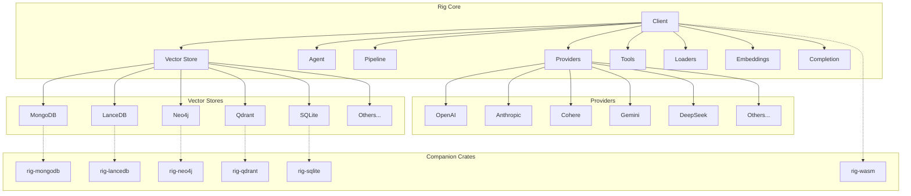
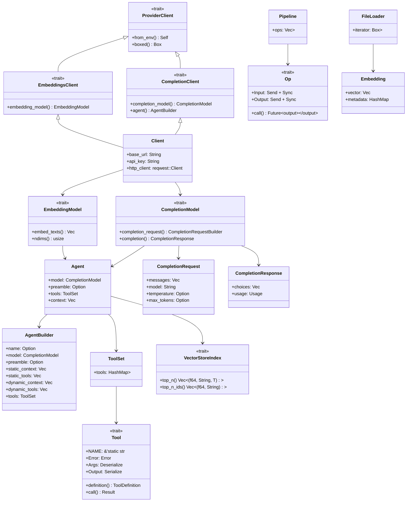
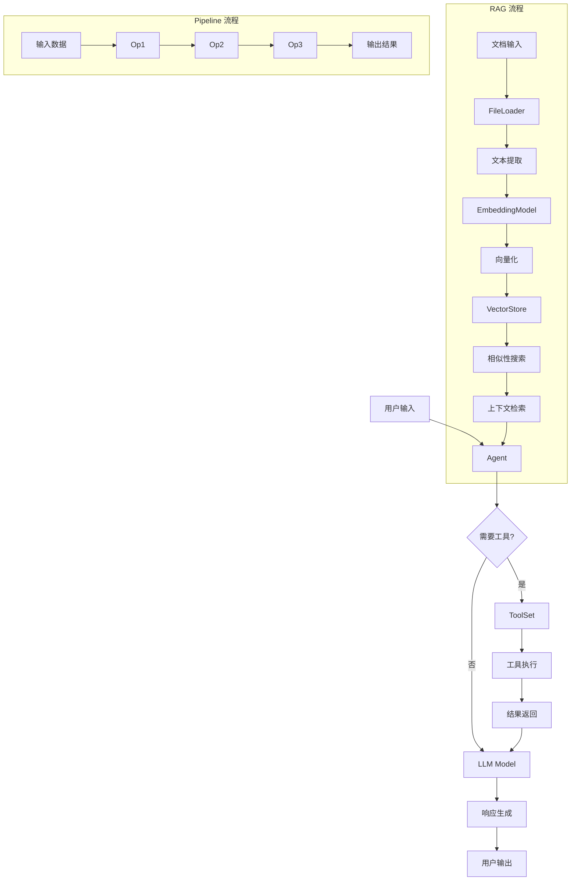
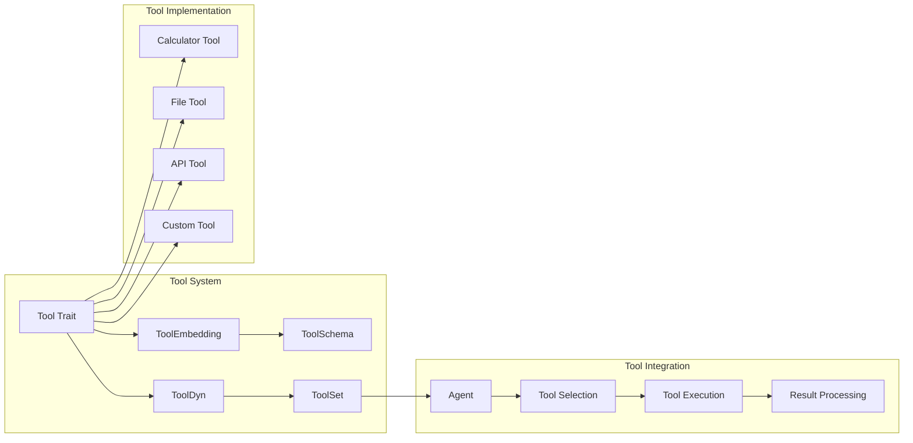

# Rig 设计文档

Rig 是一个用 Rust 编写的库，旨在为构建 LLM 驱动的应用程序提供符合人体工程学和模块化的方法。其核心概念和组件可以概括为以下几点：

## 核心概念和特性

* **LLM 工作流支持**: Rig 提供对 LLM 完成（Completion）和嵌入（Embedding）工作流的全面支持，旨在用最少的样板代码将 LLM 集成到应用程序中。
* **通用抽象**: 库通过简单而强大的抽象来统一处理不同的 LLM 提供商和向量存储。
* **模块化**: Rig 的设计允许用户根据需要集成不同的组件，例如 LLM 提供商、向量存储和工具，这些通常以单独的 companion-crates（伴生 crate）形式提供。

## 关键组件和元素

### 1. LLM 提供商（LLM Providers）

Rig 提供了对多种 LLM 提供商的原生支持。这些提供商通过 `rig-core` crate 中的 `providers` 模块进行管理。

**支持的提供商**: 包括 Anthropic、Azure、Cohere、Deepseek、Galadriel、Gemini、Groq、Huggingface、Hyperbolic、Mira、Mistral、Moonshot、Ollama、Openai、OpenRouter、Perplexity、Together、Voyage AI 和 xAI。

**核心数据结构**:
- `ProviderClient` - 所有提供商客户端的基 trait
- `CompletionClient` - 完成模型客户端 trait
- `EmbeddingsClient` - 嵌入模型客户端 trait

**具体实现**:
```rust
pub struct Client {
    base_url: String,
    api_key: String,
    http_client: reqwest::Client,
}
```

### 2. 向量存储（Vector Stores）

用于处理向量搜索和检索增强生成（RAG）工作流的组件。它们作为独立的 `companion-crates` 提供，方便按需集成。

**支持的向量存储**: 包括 MongoDB (`rig-mongodb`)、LanceDB (`rig-lancedb`)、Neo4j (`rig-neo4j`)、Qdrant (`rig-qdrant`)、SQLite (`rig-sqlite`)、SurrealDB (`rig-surrealdb`)、Milvus (`rig-milvus`)、ScyllaDB (`rig-scylladb`) 和 AWS S3Vectors (`rig-s3vectors`)。

**核心数据结构**:
```rust
pub trait VectorStoreIndex: Send + Sync {
    fn top_n<T: for<'a> Deserialize<'a> + Send>(
        &self,
        req: VectorSearchRequest,
    ) -> impl Future<Output = Result<Vec<(f64, String, T)>, VectorStoreError>> + Send;
}
```

### 3. 代理（Agents）

Rig 提供了 `Agent` 组件，用于执行更复杂的任务，例如工具使用、多轮对话、链式调用（chaining）和自主工作流。在 `rig-core/examples` 中有多个示例展示了不同类型的代理实现。

**核心数据结构**:
```rust
pub struct AgentBuilder<M: CompletionModel> {
    name: Option<String>,
    model: M,
    preamble: Option<String>,
    static_context: Vec<Document>,
    static_tools: Vec<String>,
    dynamic_context: Vec<(usize, Box<dyn VectorStoreIndexDyn>)>,
    dynamic_tools: Vec<(usize, Box<dyn VectorStoreIndexDyn>)>,
    tools: ToolSet,
    temperature: Option<f64>,
    max_tokens: Option<u64>,
    additional_params: Option<serde_json::Value>,
}
```

### 4. 工具（Tools）

Rig 允许 LLM 使用外部工具来扩展其能力。通过 `rig-core-derive` 宏，用户可以轻松创建自定义工具，这些工具可以被代理调用。例如，`calculator_chatbot.rs` 示例就展示了如何使用一个计算器工具。

**核心数据结构**:
```rust
pub trait Tool: Sized + Send + Sync {
    const NAME: &'static str;
    type Error: std::error::Error + Send + Sync + 'static;
    type Args: for<'a> Deserialize<'a> + Send + Sync;
    type Output: Serialize;

    fn definition(&self, _prompt: String) -> impl Future<Output = ToolDefinition> + Send + Sync;
    fn call(&self, args: Self::Args) -> impl Future<Output = Result<Self::Output, Self::Error>> + Send;
}
```

### 5. 管道（Pipeline）

`rig-core/src/pipeline` 模块定义了用于构建复杂 LLM 应用程序工作流的组件，包括操作（`op.rs`）、条件（`conditional.rs`）和并行化（`parallel.rs`）等。这使得开发人员可以设计和编排多个 LLM 调用和工具操作。

**核心数据结构**:
```rust
pub trait Op: Send + Sync {
    type Input: Send + Sync;
    type Output: Send + Sync;

    fn call(&self, input: Self::Input) -> impl Future<Output = Self::Output> + Send;
}
```

### 6. 加载器（Loaders）

为了方便处理不同格式的文档，Rig 提供了加载器（Loaders）组件。

**支持的加载器**: 包含 PDF (`rig-core/src/loaders/pdf.rs`) 和 EPUB (`rig-core/src/loaders/epub/loader.rs`) 等文件格式。这对于检索增强生成（RAG）应用程序非常有用，因为它允许从文档中提取文本内容。

**核心数据结构**:
```rust
pub struct FileLoader<'a, T> {
    iterator: Box<dyn Iterator<Item = T> + 'a>,
}
```

### 7. 客户端（Client）

`Client` 是与 LLM 提供商交互的核心组件，封装了对 LLM 完成、嵌入、图像生成、音频生成和转录等 API 的调用。

**功能**: 支持 `completion`、`streaming`、`embeddings`、`transcription` 等功能。

**核心数据结构**:
```rust
pub struct ClientBuilder<'a> {
    api_key: &'a str,
    base_url: &'a str,
    http_client: Option<reqwest::Client>,
}
```

### 8. WASM 支持

Rig 还提供 `rig-wasm` crate，允许将库编译为 WebAssembly（WASM），从而在浏览器或边缘环境中运行。

## 模块和数据结构关系图

### 整体架构图



### 核心数据结构关系图



### 数据流图



### 工具系统架构图



## 总结

Rig 的架构设计体现了以下几个关键原则：

1. **模块化设计**: 每个组件都有清晰的接口定义，可以独立开发和测试
2. **Trait 抽象**: 通过 trait 定义通用接口，支持多种实现
3. **Builder 模式**: 使用 Builder 模式简化复杂对象的构建
4. **异步支持**: 全面支持 async/await，适合高并发场景
5. **错误处理**: 统一的错误类型和错误传播机制
6. **扩展性**: 通过 companion crates 支持新的提供商和存储后端

这种设计使得 Rig 能够灵活地适应不同的使用场景，从简单的 LLM 调用到复杂的 RAG 系统，都能通过组合现有的组件来实现。
