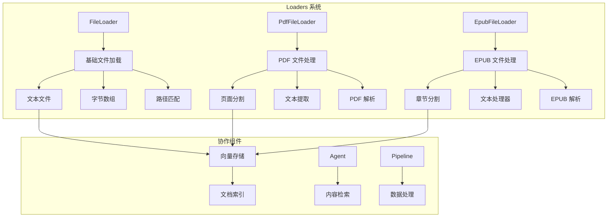
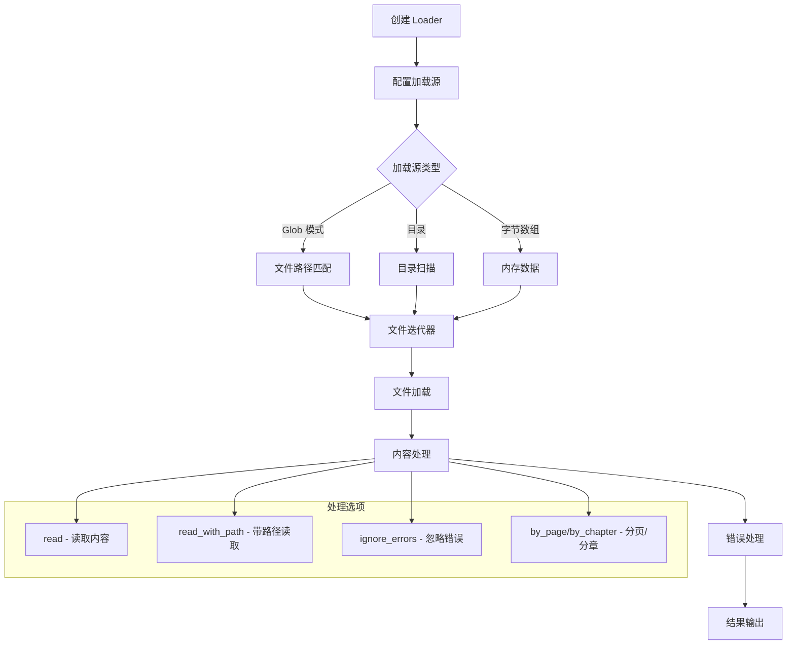
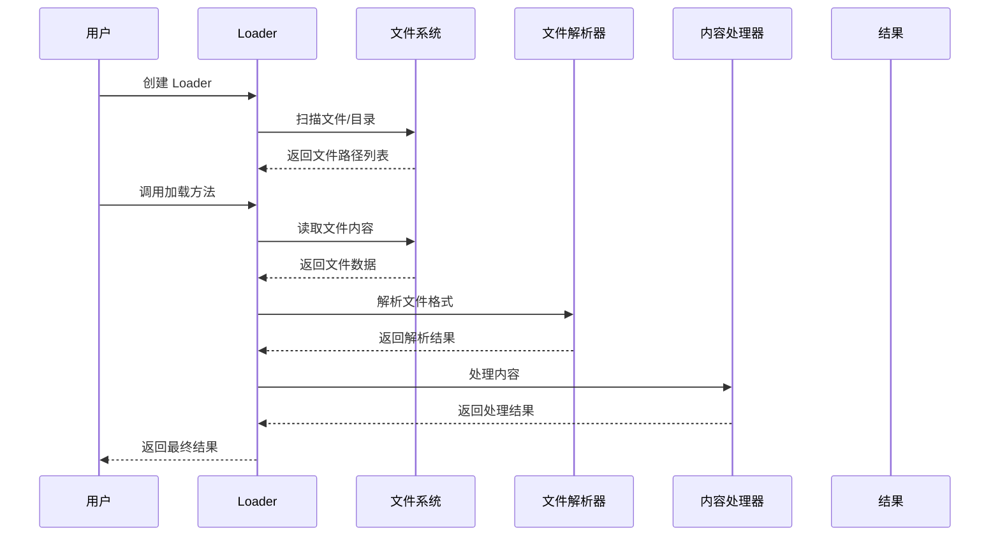
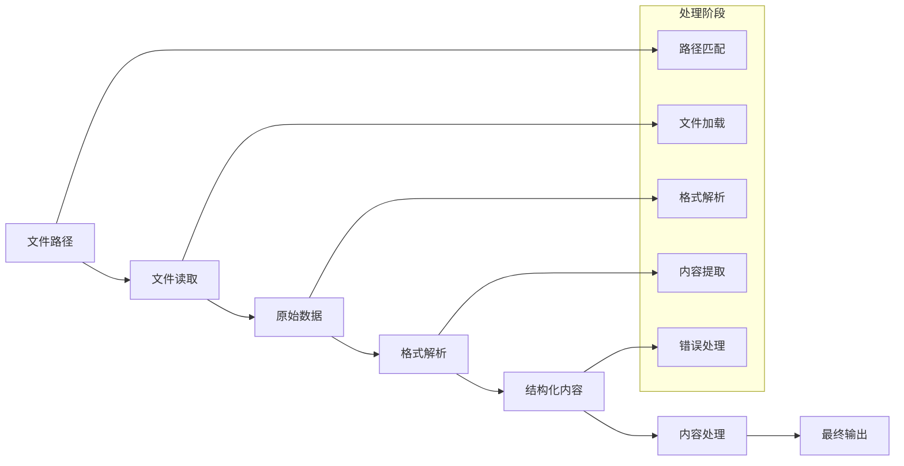
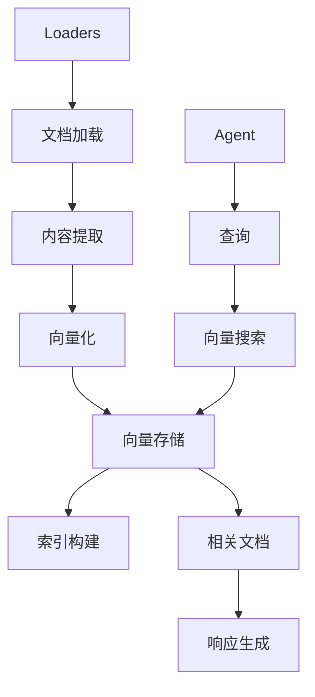
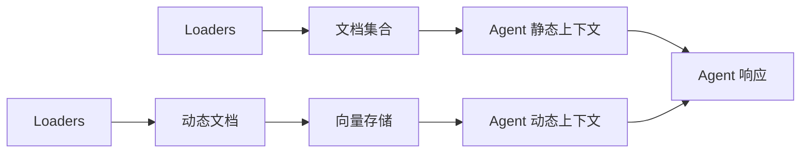
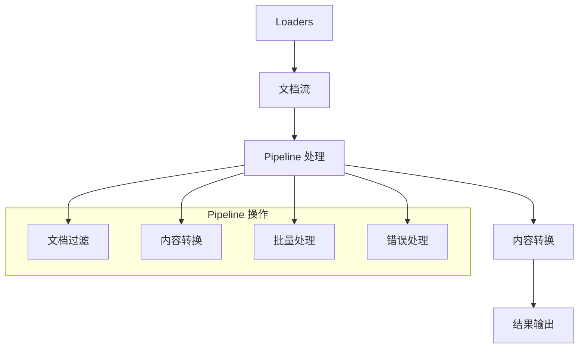

# Rig Loaders 执行和协作流程详解

## 概述

Rig 的 Loaders 系统是一个强大的文件加载和预处理框架，专门设计用于处理各种文件格式，包括文本文件、PDF 文件和 EPUB 文件。Loaders 系统提供了统一的接口来加载文件，支持文件路径匹配、错误处理、内容预处理等功能，特别适合构建 RAG（检索增强生成）应用程序。

## Loaders 核心概念

### 1. 基本架构



### 2. 核心组件

**FileLoader**: 基础文件加载器
```rust
pub struct FileLoader<'a, T> {
    iterator: Box<dyn Iterator<Item = T> + 'a>,
}
```

**PdfFileLoader**: PDF 文件专用加载器
```rust
pub struct PdfFileLoader<'a, T> {
    iterator: Box<dyn Iterator<Item = T> + 'a>,
}
```

**EpubFileLoader**: EPUB 文件专用加载器
```rust
pub struct EpubFileLoader<'a, T, P = RawTextProcessor> {
    iterator: Box<dyn Iterator<Item = T> + 'a>,
    _processor: PhantomData<P>,
}
```

## Loaders 执行流程

### 1. 基本执行流程



### 2. 详细执行时序图



### 3. 数据流转换图



## Loaders 类型和实现

### 1. 基础文件加载器（FileLoader）

**基本功能**:
```rust
use rig::loaders::FileLoader;

// 使用 glob 模式创建加载器
let loader = FileLoader::with_glob("docs/*.txt")?;

// 使用目录创建加载器
let loader = FileLoader::with_dir("docs")?;

// 从字节数组创建加载器
let loader = FileLoader::from_bytes(file_bytes);
let loader = FileLoader::from_bytes_multi(vec![file1_bytes, file2_bytes]);
```

**读取方法**:
```rust
// 读取文件内容
let contents = loader.read().into_iter();
for result in contents {
    match result {
        Ok(content) => println!("{}", content),
        Err(e) => eprintln!("Error: {}", e),
    }
}

// 读取文件内容和路径
let contents_with_paths = loader.read_with_path().into_iter();
for result in contents_with_paths {
    match result {
        Ok((path, content)) => println!("{:?}: {}", path, content),
        Err(e) => eprintln!("Error: {}", e),
    }
}

// 忽略错误
let contents = loader.read().ignore_errors().into_iter();
for content in contents {
    println!("{}", content);
}
```

### 2. PDF 文件加载器（PdfFileLoader）

**基本功能**:
```rust
use rig::loaders::PdfFileLoader;

// 使用 glob 模式创建 PDF 加载器
let loader = PdfFileLoader::with_glob("docs/*.pdf")?;

// 使用目录创建 PDF 加载器
let loader = PdfFileLoader::with_dir("docs")?;

// 从字节数组创建 PDF 加载器
let loader = PdfFileLoader::from_bytes(pdf_bytes);
let loader = PdfFileLoader::from_bytes_multi(vec![pdf1_bytes, pdf2_bytes]);
```

**PDF 处理方法**:
```rust
// 加载 PDF 文档
let documents = loader.load().into_iter();
for result in documents {
    match result {
        Ok(doc) => println!("PDF loaded: {} pages", doc.page_iter().count()),
        Err(e) => eprintln!("Error loading PDF: {}", e),
    }
}

// 按页面分割
let pages = loader.load().by_page().into_iter();
for result in pages {
    match result {
        Ok(page_content) => println!("Page: {}", page_content),
        Err(e) => eprintln!("Error reading page: {}", e),
    }
}

// 带路径的页面分割
let pages_with_paths = loader.load_with_path().by_page().into_iter();
for result in pages_with_paths {
    match result {
        Ok((path, pages)) => {
            println!("File: {:?}", path);
            for (page_no, content) in pages {
                println!("Page {}: {}", page_no, content);
            }
        }
        Err(e) => eprintln!("Error: {}", e),
    }
}
```

### 3. EPUB 文件加载器（EpubFileLoader）

**基本功能**:
```rust
use rig::loaders::{EpubFileLoader, RawTextProcessor, StripXmlProcessor};

// 使用原始文本处理器
let loader = EpubFileLoader::<_, RawTextProcessor>::with_glob("docs/*.epub")?;

// 使用 XML 剥离处理器
let loader = EpubFileLoader::<_, StripXmlProcessor>::with_glob("docs/*.epub")?;

// 使用目录创建 EPUB 加载器
let loader = EpubFileLoader::<_, RawTextProcessor>::with_dir("docs")?;
```

**EPUB 处理方法**:
```rust
// 加载 EPUB 文档
let documents = loader.load_with_path().into_iter();
for result in documents {
    match result {
        Ok((path, doc)) => println!("EPUB loaded: {:?}", path),
        Err(e) => eprintln!("Error loading EPUB: {}", e),
    }
}

// 按章节分割
let chapters = loader.load().by_chapter().into_iter();
for result in chapters {
    match result {
        Ok(chapter_content) => println!("Chapter: {}", chapter_content),
        Err(e) => eprintln!("Error reading chapter: {}", e),
    }
}

// 带路径的章节分割
let chapters_with_paths = loader.load_with_path().by_chapter().into_iter();
for result in chapters_with_paths {
    match result {
        Ok((path, chapters)) => {
            println!("File: {:?}", path);
            for (chapter_no, content) in chapters {
                println!("Chapter {}: {}", chapter_no, content);
            }
        }
        Err(e) => eprintln!("Error: {}", e),
    }
}
```

## Loaders 协作模式

### 1. 与向量存储协作



### 2. 与 Agent 协作



### 3. 与 Pipeline 协作



## 实际使用示例

### 1. 基础文件加载

```rust
use rig::loaders::FileLoader;
use std::path::PathBuf;

#[tokio::main]
async fn main() -> Result<(), anyhow::Error> {
    // 创建文件加载器
    let loader = FileLoader::with_glob("docs/*.txt")?;

    // 读取所有文件内容
    let contents: Vec<String> = loader
        .read()
        .ignore_errors()
        .into_iter()
        .collect();

    println!("Loaded {} text files", contents.len());
    for (i, content) in contents.iter().enumerate() {
        println!("File {}: {} characters", i + 1, content.len());
    }

    // 读取文件内容和路径
    let contents_with_paths: Vec<(PathBuf, String)> = loader
        .read_with_path()
        .ignore_errors()
        .into_iter()
        .collect();

    for (path, content) in contents_with_paths {
        println!("{:?}: {} characters", path, content.len());
    }

    Ok(())
}
```

### 2. PDF 文档处理

```rust
use rig::loaders::PdfFileLoader;
use std::path::PathBuf;

#[tokio::main]
async fn main() -> Result<(), anyhow::Error> {
    // 创建 PDF 加载器
    let loader = PdfFileLoader::with_glob("docs/*.pdf")?;

    // 按页面处理 PDF
    let pages: Vec<String> = loader
        .load()
        .by_page()
        .ignore_errors()
        .into_iter()
        .collect();

    println!("Extracted {} pages from PDFs", pages.len());
    for (i, page_content) in pages.iter().enumerate() {
        println!("Page {}: {} characters", i + 1, page_content.len());
    }

    // 带路径的页面处理
    let pages_with_paths: Vec<(PathBuf, Vec<(usize, String)>)> = loader
        .load_with_path()
        .by_page()
        .ignore_errors()
        .into_iter()
        .collect();

    for (path, pages) in pages_with_paths {
        println!("File: {:?}", path.display());
        for (page_no, content) in pages {
            println!("  Page {}: {} characters", page_no, content.len());
        }
    }

    Ok(())
}
```

### 3. EPUB 文档处理

```rust
use rig::loaders::{EpubFileLoader, RawTextProcessor, StripXmlProcessor};

#[tokio::main]
async fn main() -> Result<(), anyhow::Error> {
    // 使用原始文本处理器
    let loader = EpubFileLoader::<_, RawTextProcessor>::with_glob("docs/*.epub")?;

    // 按章节处理 EPUB
    let chapters: Vec<String> = loader
        .load()
        .by_chapter()
        .ignore_errors()
        .into_iter()
        .collect();

    println!("Extracted {} chapters from EPUBs", chapters.len());
    for (i, chapter_content) in chapters.iter().enumerate() {
        println!("Chapter {}: {} characters", i + 1, chapter_content.len());
    }

    // 使用 XML 剥离处理器
    let loader = EpubFileLoader::<_, StripXmlProcessor>::with_glob("docs/*.epub")?;

    let clean_chapters: Vec<String> = loader
        .load()
        .by_chapter()
        .ignore_errors()
        .into_iter()
        .collect();

    println!("Extracted {} clean chapters from EPUBs", clean_chapters.len());
    for (i, chapter_content) in clean_chapters.iter().enumerate() {
        println!("Clean Chapter {}: {} characters", i + 1, chapter_content.len());
    }

    Ok(())
}
```

### 4. 与向量存储集成

```rust
use rig::loaders::{FileLoader, PdfFileLoader, EpubFileLoader, RawTextProcessor};
use rig::embeddings::EmbeddingsBuilder;
use rig::vector_store::in_memory_store::InMemoryVectorStore;
use rig::prelude::*;

#[derive(rig_derive::Embed, Serialize, Clone)]
struct Document {
    id: String,
    #[embed]
    content: String,
    file_type: String,
    metadata: HashMap<String, String>,
}

#[tokio::main]
async fn main() -> Result<(), anyhow::Error> {
    let openai_client = openai::Client::from_env();
    let embedding_model = openai_client.embedding_model(openai::TEXT_EMBEDDING_ADA_002);

    let mut documents = Vec::new();

    // 加载文本文件
    let text_loader = FileLoader::with_glob("docs/*.txt")?;
    let text_contents: Vec<(PathBuf, String)> = text_loader
        .read_with_path()
        .ignore_errors()
        .into_iter()
        .collect();

    for (path, content) in text_contents {
        documents.push(Document {
            id: path.to_string_lossy().to_string(),
            content,
            file_type: "text".to_string(),
            metadata: HashMap::new(),
        });
    }

    // 加载 PDF 文件
    let pdf_loader = PdfFileLoader::with_glob("docs/*.pdf")?;
    let pdf_pages: Vec<(PathBuf, Vec<(usize, String)>)> = pdf_loader
        .load_with_path()
        .by_page()
        .ignore_errors()
        .into_iter()
        .collect();

    for (path, pages) in pdf_pages {
        for (page_no, content) in pages {
            documents.push(Document {
                id: format!("{}_page_{}", path.to_string_lossy(), page_no),
                content,
                file_type: "pdf".to_string(),
                metadata: HashMap::from([
                    ("file_path".to_string(), path.to_string_lossy().to_string()),
                    ("page_number".to_string(), page_no.to_string()),
                ]),
            });
        }
    }

    // 加载 EPUB 文件
    let epub_loader = EpubFileLoader::<_, RawTextProcessor>::with_glob("docs/*.epub")?;
    let epub_chapters: Vec<(PathBuf, Vec<(usize, String)>)> = epub_loader
        .load_with_path()
        .by_chapter()
        .ignore_errors()
        .into_iter()
        .collect();

    for (path, chapters) in epub_chapters {
        for (chapter_no, content) in chapters {
            documents.push(Document {
                id: format!("{}_chapter_{}", path.to_string_lossy(), chapter_no),
                content,
                file_type: "epub".to_string(),
                metadata: HashMap::from([
                    ("file_path".to_string(), path.to_string_lossy().to_string()),
                    ("chapter_number".to_string(), chapter_no.to_string()),
                ]),
            });
        }
    }

    // 创建向量存储
    let embeddings = EmbeddingsBuilder::new(embedding_model.clone())
        .documents(documents)?
        .build()
        .await?;

    let vector_store = InMemoryVectorStore::from_documents_with_id_f(embeddings, |doc| doc.id.clone());
    let index = vector_store.index(embedding_model);

    println!("Created vector store with {} documents", documents.len());

    Ok(())
}
```

### 5. 与 Agent 集成

```rust
use rig::loaders::{FileLoader, PdfFileLoader, EpubFileLoader, RawTextProcessor};
use rig::prelude::*;

#[tokio::main]
async fn main() -> Result<(), anyhow::Error> {
    let openai_client = openai::Client::from_env();

    // 加载文档作为静态上下文
    let text_loader = FileLoader::with_glob("docs/*.txt")?;
    let text_contents: Vec<String> = text_loader
        .read()
        .ignore_errors()
        .into_iter()
        .collect();

    let pdf_loader = PdfFileLoader::with_glob("docs/*.pdf")?;
    let pdf_contents: Vec<String> = pdf_loader
        .load()
        .by_page()
        .ignore_errors()
        .into_iter()
        .collect();

    let epub_loader = EpubFileLoader::<_, RawTextProcessor>::with_glob("docs/*.epub")?;
    let epub_contents: Vec<String> = epub_loader
        .load()
        .by_chapter()
        .ignore_errors()
        .into_iter()
        .collect();

    // 创建文档集合
    let mut documents = Vec::new();

    for (i, content) in text_contents.iter().enumerate() {
        documents.push(completion::Document {
            id: format!("text_{}", i),
            text: content.clone(),
            additional_props: HashMap::new(),
        });
    }

    for (i, content) in pdf_contents.iter().enumerate() {
        documents.push(completion::Document {
            id: format!("pdf_{}", i),
            text: content.clone(),
            additional_props: HashMap::new(),
        });
    }

    for (i, content) in epub_contents.iter().enumerate() {
        documents.push(completion::Document {
            id: format!("epub_{}", i),
            text: content.clone(),
            additional_props: HashMap::new(),
        });
    }

    // 创建带文档上下文的 Agent
    let agent = openai_client
        .agent(openai::GPT_4O)
        .preamble("You are a helpful assistant with access to various documents. Use the provided context to answer questions accurately.")
        .static_context(documents)
        .build();

    // 使用 Agent
    let response = agent.prompt("What are the main topics covered in the provided documents?").await?;
    println!("Agent response: {}", response);

    Ok(())
}
```

### 6. 与 Pipeline 集成

```rust
use rig::loaders::{FileLoader, PdfFileLoader, EpubFileLoader, RawTextProcessor};
use rig::pipeline::{self, Op};
use rig::prelude::*;

#[tokio::main]
async fn main() -> Result<(), anyhow::Error> {
    // 创建文档处理 Pipeline
    let document_pipeline = pipeline::new()
        .map(|file_path: String| {
            // 根据文件扩展名选择加载器
            if file_path.ends_with(".txt") {
                FileLoader::with_glob(&file_path)
                    .and_then(|loader| Ok(loader.read().ignore_errors().into_iter().collect::<Vec<_>>()))
            } else if file_path.ends_with(".pdf") {
                PdfFileLoader::with_glob(&file_path)
                    .and_then(|loader| Ok(loader.load().by_page().ignore_errors().into_iter().collect::<Vec<_>>()))
            } else if file_path.ends_with(".epub") {
                EpubFileLoader::<_, RawTextProcessor>::with_glob(&file_path)
                    .and_then(|loader| Ok(loader.load().by_chapter().ignore_errors().into_iter().collect::<Vec<_>>()))
            } else {
                Err(anyhow::anyhow!("Unsupported file type"))
            }
        })
        .map(|contents: Vec<String>| {
            // 合并所有内容
            contents.join("\n\n")
        })
        .map(|combined_content: String| {
            // 清理和预处理内容
            combined_content
                .lines()
                .filter(|line| !line.trim().is_empty())
                .collect::<Vec<_>>()
                .join("\n")
        });

    // 使用 Pipeline 处理文档
    let file_paths = vec![
        "docs/document1.txt".to_string(),
        "docs/document2.pdf".to_string(),
        "docs/document3.epub".to_string(),
    ];

    for file_path in file_paths {
        let result = document_pipeline.call(file_path).await;
        match result {
            Ok(processed_content) => {
                println!("Processed content length: {} characters", processed_content.len());
                println!("First 200 characters: {}", &processed_content[..200.min(processed_content.len())]);
            }
            Err(e) => eprintln!("Error processing file: {}", e),
        }
    }

    Ok(())
}
```

### 7. 自定义文本处理器

```rust
use rig::loaders::epub::TextProcessor;
use std::error::Error;

#[derive(Debug)]
pub enum CustomProcessingError {
    ProcessingFailed(String),
}

impl std::fmt::Display for CustomProcessingError {
    fn fmt(&self, f: &mut std::fmt::Formatter<'_>) -> std::fmt::Result {
        match self {
            CustomProcessingError::ProcessingFailed(msg) => write!(f, "Processing failed: {}", msg),
        }
    }
}

impl Error for CustomProcessingError {}

pub struct CustomTextProcessor;

impl TextProcessor for CustomTextProcessor {
    type Error = CustomProcessingError;

    fn process(text: &str) -> Result<String, Self::Error> {
        // 自定义文本处理逻辑
        let mut processed = text.to_string();

        // 移除多余的空白字符
        processed = processed
            .lines()
            .map(|line| line.trim())
            .filter(|line| !line.is_empty())
            .collect::<Vec<_>>()
            .join("\n");

        // 转换为小写
        processed = processed.to_lowercase();

        // 移除特殊字符
        processed = processed
            .chars()
            .filter(|c| c.is_alphanumeric() || c.is_whitespace() || *c == '\n')
            .collect();

        if processed.is_empty() {
            Err(CustomProcessingError::ProcessingFailed("Empty content after processing".to_string()))
        } else {
            Ok(processed)
        }
    }
}

// 使用自定义处理器
#[tokio::main]
async fn main() -> Result<(), anyhow::Error> {
    let loader = EpubFileLoader::<_, CustomTextProcessor>::with_glob("docs/*.epub")?;

    let processed_chapters: Vec<String> = loader
        .load()
        .by_chapter()
        .ignore_errors()
        .into_iter()
        .collect();

    for (i, chapter) in processed_chapters.iter().enumerate() {
        println!("Processed Chapter {}: {}", i + 1, chapter);
    }

    Ok(())
}
```

### 8. 批量文档处理

```rust
use rig::loaders::{FileLoader, PdfFileLoader, EpubFileLoader, RawTextProcessor};
use std::collections::HashMap;
use tokio::time::{sleep, Duration};

#[tokio::main]
async fn main() -> Result<(), anyhow::Error> {
    let mut all_documents = HashMap::new();

    // 批量处理文本文件
    let text_loader = FileLoader::with_glob("docs/*.txt")?;
    let text_contents: Vec<(String, String)> = text_loader
        .read_with_path()
        .ignore_errors()
        .into_iter()
        .map(|(path, content)| (path.to_string_lossy().to_string(), content))
        .collect();

    for (path, content) in text_contents {
        all_documents.insert(path, ("text".to_string(), content));
    }

    // 批量处理 PDF 文件
    let pdf_loader = PdfFileLoader::with_glob("docs/*.pdf")?;
    let pdf_contents: Vec<(String, Vec<(usize, String)>)> = pdf_loader
        .load_with_path()
        .by_page()
        .ignore_errors()
        .into_iter()
        .map(|(path, pages)| (path.to_string_lossy().to_string(), pages))
        .collect();

    for (path, pages) in pdf_contents {
        for (page_no, content) in pages {
            let page_key = format!("{}_page_{}", path, page_no);
            all_documents.insert(page_key, ("pdf".to_string(), content));
        }
    }

    // 批量处理 EPUB 文件
    let epub_loader = EpubFileLoader::<_, RawTextProcessor>::with_glob("docs/*.epub")?;
    let epub_contents: Vec<(String, Vec<(usize, String)>)> = epub_loader
        .load_with_path()
        .by_chapter()
        .ignore_errors()
        .into_iter()
        .map(|(path, chapters)| (path.to_string_lossy().to_string(), chapters))
        .collect();

    for (path, chapters) in epub_contents {
        for (chapter_no, content) in chapters {
            let chapter_key = format!("{}_chapter_{}", path, chapter_no);
            all_documents.insert(chapter_key, ("epub".to_string(), content));
        }
    }

    // 批量处理所有文档
    println!("Processing {} documents...", all_documents.len());

    for (key, (doc_type, content)) in all_documents.iter() {
        println!("Processing {} ({})", key, doc_type);

        // 模拟处理时间
        sleep(Duration::from_millis(100)).await;

        // 这里可以添加实际的文档处理逻辑
        let processed_content = content
            .lines()
            .filter(|line| !line.trim().is_empty())
            .collect::<Vec<_>>()
            .join("\n");

        println!("  - Original: {} characters", content.len());
        println!("  - Processed: {} characters", processed_content.len());
    }

    println!("Completed processing all documents!");

    Ok(())
}
```

## Loaders 开发最佳实践

### 1. 错误处理

```rust
use rig::loaders::FileLoader;
use thiserror::Error;

#[derive(Error, Debug)]
pub enum DocumentProcessingError {
    #[error("File loading error: {0}")]
    FileLoading(#[from] rig::loaders::file::FileLoaderError),

    #[error("PDF processing error: {0}")]
    PdfProcessing(#[from] rig::loaders::pdf::PdfLoaderError),

    #[error("EPUB processing error: {0}")]
    EpubProcessing(#[from] rig::loaders::epub::errors::EpubLoaderError),

    #[error("Content validation error: {0}")]
    ContentValidation(String),
}

fn process_documents() -> Result<(), DocumentProcessingError> {
    // 处理文本文件
    let text_loader = FileLoader::with_glob("docs/*.txt")?;
    let text_contents: Vec<String> = text_loader
        .read()
        .ignore_errors()
        .into_iter()
        .collect();

    // 验证内容
    for content in text_contents {
        if content.trim().is_empty() {
            return Err(DocumentProcessingError::ContentValidation("Empty content found".to_string()));
        }
    }

    Ok(())
}
```

### 2. 性能优化

```rust
use rig::loaders::{FileLoader, PdfFileLoader, EpubFileLoader, RawTextProcessor};
use tokio::task::JoinSet;
use std::path::PathBuf;

#[tokio::main]
async fn main() -> Result<(), anyhow::Error> {
    let mut join_set = JoinSet::new();

    // 并行处理不同类型的文件
    let text_loader = FileLoader::with_glob("docs/*.txt")?;
    join_set.spawn(async move {
        let contents: Vec<String> = text_loader
            .read()
            .ignore_errors()
            .into_iter()
            .collect();
        Ok::<_, anyhow::Error>(("text", contents))
    });

    let pdf_loader = PdfFileLoader::with_glob("docs/*.pdf")?;
    join_set.spawn(async move {
        let contents: Vec<String> = pdf_loader
            .load()
            .by_page()
            .ignore_errors()
            .into_iter()
            .collect();
        Ok::<_, anyhow::Error>(("pdf", contents))
    });

    let epub_loader = EpubFileLoader::<_, RawTextProcessor>::with_glob("docs/*.epub")?;
    join_set.spawn(async move {
        let contents: Vec<String> = epub_loader
            .load()
            .by_chapter()
            .ignore_errors()
            .into_iter()
            .collect();
        Ok::<_, anyhow::Error>(("epub", contents))
    });

    // 收集所有结果
    let mut results = HashMap::new();
    while let Some(result) = join_set.join_next().await {
        match result {
            Ok(Ok((doc_type, contents))) => {
                results.insert(doc_type.to_string(), contents);
            }
            Ok(Err(e)) => eprintln!("Error processing documents: {}", e),
            Err(e) => eprintln!("Task join error: {}", e),
        }
    }

    println!("Processed {} document types", results.len());
    for (doc_type, contents) in results {
        println!("{}: {} documents", doc_type, contents.len());
    }

    Ok(())
}
```

### 3. 内存管理

```rust
use rig::loaders::{FileLoader, PdfFileLoader, EpubFileLoader, RawTextProcessor};
use std::io::{BufRead, BufReader};

fn process_large_files() -> Result<(), anyhow::Error> {
    // 使用流式处理大文件
    let loader = FileLoader::with_glob("docs/*.txt")?;

    for result in loader.read().into_iter() {
        match result {
            Ok(content) => {
                // 逐行处理，避免将整个文件加载到内存
                let lines: Vec<&str> = content.lines().collect();
                for line in lines {
                    if line.len() > 1000 {
                        // 处理长行
                        process_long_line(line);
                    } else {
                        // 处理普通行
                        process_normal_line(line);
                    }
                }
            }
            Err(e) => eprintln!("Error reading file: {}", e),
        }
    }

    Ok(())
}

fn process_long_line(line: &str) {
    // 分块处理长行
    let chunk_size = 1000;
    for chunk in line.as_bytes().chunks(chunk_size) {
        if let Ok(chunk_str) = std::str::from_utf8(chunk) {
            // 处理分块内容
            println!("Processing chunk: {} characters", chunk_str.len());
        }
    }
}

fn process_normal_line(line: &str) {
    // 处理普通行
    println!("Processing line: {} characters", line.len());
}
```

## 总结

Rig 的 Loaders 系统提供了：

1. **统一的文件加载接口**: 支持文本、PDF、EPUB 等多种文件格式
2. **灵活的文件匹配**: 支持 glob 模式和目录扫描
3. **强大的内容处理**: 支持页面分割、章节分割、文本预处理
4. **完善的错误处理**: 提供详细的错误类型和错误处理机制
5. **内存效率**: 支持流式处理和分块处理大文件
6. **类型安全**: 编译时类型检查，确保处理流程的正确性
7. **扩展性**: 支持自定义文本处理器和内容转换器

这种设计使得开发者能够：

- 快速加载和处理各种文件格式
- 构建高效的文档处理流水线
- 与向量存储和 Agent 系统无缝集成
- 实现复杂的文档预处理和后处理逻辑
- 创建高性能的 RAG 应用程序

Loaders 系统特别适合构建需要处理大量文档、构建知识库、实现文档检索等功能的 AI 应用。
```
