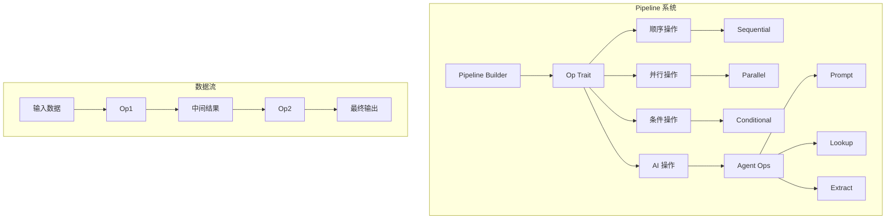
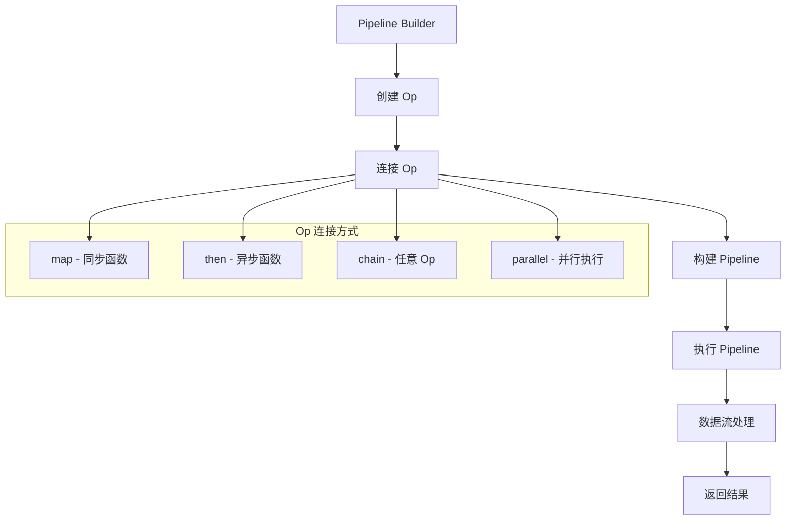
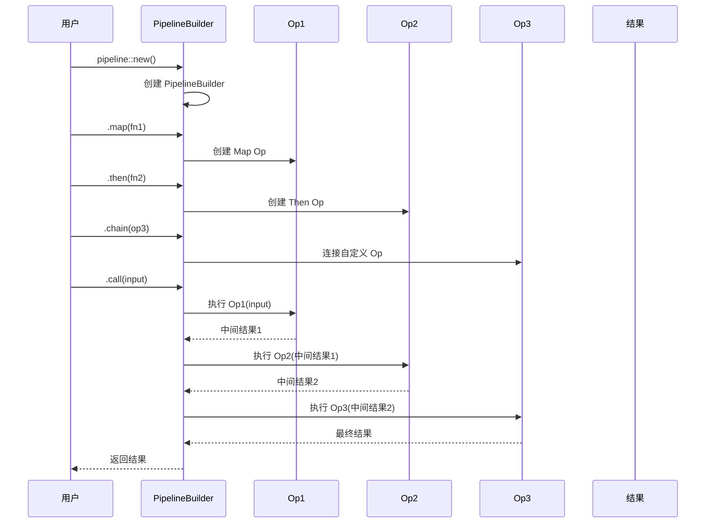
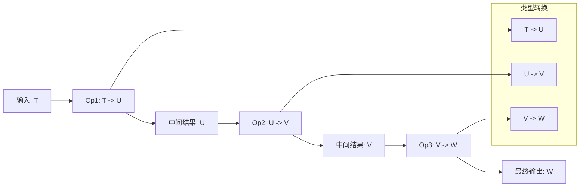
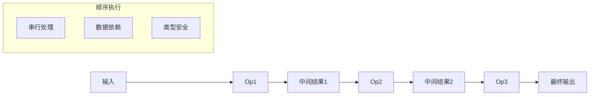
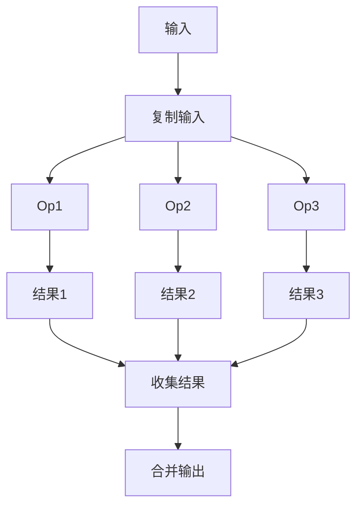
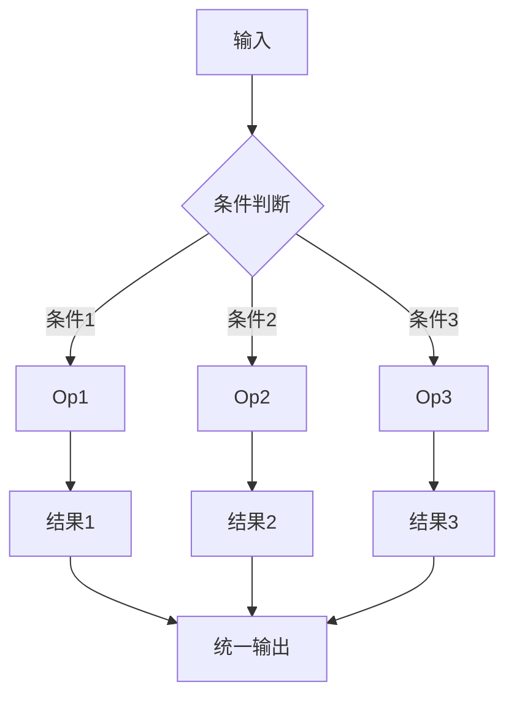

# Rig Pipeline 执行和协作流程详解

## 概述

Rig 的 Pipeline 系统是一个灵活的编排框架，用于构建复杂的 AI 工作流。Pipeline 可以被视为一个有向无环图（DAG），其中每个节点是一个操作（Op），边代表数据流。Pipeline 系统提供了丰富的组合器来连接操作，支持顺序执行、并行执行和条件分支。

## Pipeline 核心概念

### 1. 基本架构



### 2. 核心组件

**Op Trait**: 所有操作的基础接口
```rust
pub trait Op: Send + Sync {
    type Input: Send + Sync;
    type Output: Send + Sync;

    fn call(&self, input: Self::Input) -> impl Future<Output = Self::Output> + Send;
}
```

**Pipeline Builder**: 构建 Pipeline 的入口点
```rust
pub struct PipelineBuilder<E> {
    _error: std::marker::PhantomData<E>,
}
```

## Pipeline 执行流程

### 1. 基本执行流程



### 2. 详细执行时序图



### 3. 数据流转换图



## Pipeline 操作类型

### 1. 基础操作

**Map 操作**: 同步函数转换
```rust
pub struct Map<F, Input> {
    f: F,
    _t: std::marker::PhantomData<Input>,
}

impl<F, Input, Output> Op for Map<F, Input>
where
    F: Fn(Input) -> Output + Send + Sync,
    Input: Send + Sync,
    Output: Send + Sync,
{
    type Input = Input;
    type Output = Output;

    async fn call(&self, input: Self::Input) -> Self::Output {
        (self.f)(input)
    }
}
```

**Then 操作**: 异步函数转换
```rust
pub struct Then<F, Input> {
    f: F,
    _t: std::marker::PhantomData<Input>,
}

impl<F, Fut, Input> Op for Then<F, Input>
where
    F: Fn(Input) -> Fut + Send + Sync,
    Fut: Future + Send + Sync,
    Fut::Output: Send + Sync,
{
    type Input = Input;
    type Output = Fut::Output;

    async fn call(&self, input: Self::Input) -> Self::Output {
        (self.f)(input).await
    }
}
```

**Passthrough 操作**: 数据透传
```rust
pub struct Passthrough<T> {
    _t: std::marker::PhantomData<T>,
}

impl<T> Op for Passthrough<T>
where
    T: Send + Sync,
{
    type Input = T;
    type Output = T;

    async fn call(&self, input: Self::Input) -> Self::Output {
        input
    }
}
```

### 2. 组合操作

**Sequential 操作**: 顺序连接
```rust
pub struct Sequential<Op1, Op2> {
    prev: Op1,
    op: Op2,
}

impl<Op1, Op2> Op for Sequential<Op1, Op2>
where
    Op1: Op,
    Op2: Op<Input = Op1::Output>,
{
    type Input = Op1::Input;
    type Output = Op2::Output;

    async fn call(&self, input: Self::Input) -> Self::Output {
        let prev = self.prev.call(input).await;
        self.op.call(prev).await
    }
}
```

**Parallel 操作**: 并行执行
```rust
pub struct Parallel<Op1, Op2> {
    op1: Op1,
    op2: Op2,
}

impl<Op1, Op2> Op for Parallel<Op1, Op2>
where
    Op1: Op,
    Op1::Input: Clone,
    Op2: Op<Input = Op1::Input>,
{
    type Input = Op1::Input;
    type Output = (Op1::Output, Op2::Output);

    async fn call(&self, input: Self::Input) -> Self::Output {
        join!(self.op1.call(input.clone()), self.op2.call(input))
    }
}
```

### 3. AI 专用操作

**Prompt 操作**: 调用 LLM Agent
```rust
pub struct Prompt<P, In> {
    prompt: P,
    _in: std::marker::PhantomData<In>,
}

impl<P, In> Op for Prompt<P, In>
where
    P: completion::Prompt + Send + Sync,
    In: Into<String> + Send + Sync,
{
    type Input = In;
    type Output = Result<String, completion::PromptError>;

    fn call(&self, input: Self::Input) -> impl Future<Output = Self::Output> + Send {
        self.prompt.prompt(input.into()).into_future()
    }
}
```

**Lookup 操作**: 向量存储检索
```rust
pub struct Lookup<I, In, T> {
    index: I,
    n: usize,
    _in: std::marker::PhantomData<In>,
    _t: std::marker::PhantomData<T>,
}

impl<I, In, T> Op for Lookup<I, In, T>
where
    I: vector_store::VectorStoreIndex,
    In: Into<String> + Send + Sync,
    T: Send + Sync + for<'a> Deserialize<'a>,
{
    type Input = In;
    type Output = Result<Vec<(f64, String, T)>, vector_store::VectorStoreError>;

    async fn call(&self, input: Self::Input) -> Self::Output {
        let query: String = input.into();
        let req = VectorSearchRequest::builder()
            .query(query)
            .samples(self.n as u64)
            .build()?;

        let docs = self.index.top_n::<T>(req).await?.into_iter().collect();
        Ok(docs)
    }
}
```

**Extract 操作**: 结构化数据提取
```rust
pub struct Extract<M, Input, Output>
where
    M: CompletionModel,
    Output: schemars::JsonSchema + for<'a> Deserialize<'a> + Send + Sync,
{
    extractor: Extractor<M, Output>,
    _in: std::marker::PhantomData<Input>,
}

impl<M, Input, Output> Op for Extract<M, Input, Output>
where
    M: CompletionModel,
    Output: schemars::JsonSchema + for<'a> Deserialize<'a> + Send + Sync,
    Input: Into<Message> + Send + Sync,
{
    type Input = Input;
    type Output = Result<Output, ExtractionError>;

    async fn call(&self, input: Self::Input) -> Self::Output {
        self.extractor.extract(input).await
    }
}
```

## Pipeline 协作模式

### 1. 顺序协作



### 2. 并行协作



### 3. 条件协作



## 实际使用示例

### 1. 基础 Pipeline 创建

```rust
use rig::pipeline::{self, Op};

#[tokio::main]
async fn main() -> Result<(), anyhow::Error> {
    // 创建简单的数学计算 Pipeline
    let math_pipeline = pipeline::new()
        .map(|(x, y): (i32, i32)| x + y)           // 加法
        .map(|sum: i32| sum * 2)                    // 乘以2
        .map(|result: i32| format!("结果: {}", result)); // 格式化

    let result = math_pipeline.call((5, 3)).await;
    println!("计算结果: {}", result);
    // 输出: 结果: 16

    Ok(())
}
```

### 2. 异步 Pipeline

```rust
use rig::pipeline::{self, Op};

#[tokio::main]
async fn main() -> Result<(), anyhow::Error> {
    // 创建异步处理 Pipeline
    let async_pipeline = pipeline::new()
        .then(|email: String| async move {
            // 异步提取用户名
            email.split('@').next().unwrap().to_string()
        })
        .then(|username: String| async move {
            // 异步生成问候语
            format!("你好, {}!", username)
        })
        .then(|greeting: String| async move {
            // 异步添加时间戳
            let now = chrono::Utc::now();
            format!("{} - 时间: {}", greeting, now.format("%H:%M:%S"))
        });

    let result = async_pipeline.call("alice@example.com".to_string()).await;
    println!("异步处理结果: {}", result);
    // 输出: 你好, alice! - 时间: 14:30:25

    Ok(())
}
```

### 3. 复杂 Pipeline 组合

```rust
use rig::pipeline::{self, Op, passthrough};

#[tokio::main]
async fn main() -> Result<(), anyhow::Error> {
    // 创建复杂的组合 Pipeline
    let complex_pipeline = pipeline::new()
        .map(|input: String| {
            // 预处理输入
            input.to_lowercase()
        })
        .chain(parallel!(
            // 并行执行三个操作
            passthrough(),                    // 保持原输入
            map(|s: String| s.len()),        // 计算长度
            map(|s: String| s.chars().count()) // 计算字符数
        ))
        .map(|(original, length, char_count): (String, usize, usize)| {
            format!(
                "原始输入: {}\n长度: {}\n字符数: {}",
                original, length, char_count
            )
        });

    let result = complex_pipeline.call("Hello World!".to_string()).await;
    println!("复杂 Pipeline 结果:\n{}", result);

    Ok(())
}
```

### 4. AI Agent Pipeline

```rust
use rig::pipeline::{self, Op};
use rig::prelude::*;

#[tokio::main]
async fn main() -> Result<(), anyhow::Error> {
    let openai_client = openai::Client::from_env();

    // 创建多个专门的 Agent
    let translator_agent = openai_client
        .agent(openai::GPT_4O)
        .preamble("你是一个翻译专家，将输入翻译成英文。")
        .build();

    let analyzer_agent = openai_client
        .agent(openai::GPT_4O)
        .preamble("你是一个文本分析专家，分析文本的情感倾向。")
        .build();

    let summarizer_agent = openai_client
        .agent(openai::GPT_4O)
        .preamble("你是一个总结专家，将分析结果总结成简洁的要点。")
        .build();

    // 创建 AI Agent Pipeline
    let ai_pipeline = pipeline::new()
        .map(|text: String| format!("请翻译以下文本: {}", text))
        .prompt(translator_agent)
        .map(|translation: Result<String, _>| {
            translation.unwrap_or_else(|_| "翻译失败".to_string())
        })
        .map(|translation: String| format!("请分析以下英文文本的情感: {}", translation))
        .prompt(analyzer_agent)
        .map(|analysis: Result<String, _>| {
            analysis.unwrap_or_else(|_| "分析失败".to_string())
        })
        .map(|analysis: String| format!("请总结以下分析结果: {}", analysis))
        .prompt(summarizer_agent)
        .map(|summary: Result<String, _>| {
            summary.unwrap_or_else(|_| "总结失败".to_string())
        });

    let result = ai_pipeline.call("今天天气很好，我很开心！".to_string()).await;
    println!("AI Pipeline 结果: {}", result);

    Ok(())
}
```

### 5. RAG Pipeline 实现

```rust
use rig::pipeline::{self, Op};
use rig::prelude::*;
use rig::embeddings::EmbeddingsBuilder;
use rig::vector_store::in_memory_store::InMemoryVectorStore;

#[derive(rig_derive::Embed, Serialize, Clone)]
struct Document {
    id: String,
    #[embed]
    content: String,
    metadata: HashMap<String, String>,
}

#[tokio::main]
async fn main() -> Result<(), anyhow::Error> {
    let openai_client = openai::Client::from_env();

    // 创建向量存储和索引
    let mut vector_store = InMemoryVectorStore::default();
    let embedding_model = openai_client.embedding_model(openai::TEXT_EMBEDDING_ADA_002);

    // 准备文档
    let documents = vec![
        Document {
            id: "doc1".to_string(),
            content: "Rust 是一种系统编程语言，专注于安全性、并发性和性能。".to_string(),
            metadata: HashMap::new(),
        },
        Document {
            id: "doc2".to_string(),
            content: "Rig 是一个用 Rust 编写的 LLM 应用开发库。".to_string(),
            metadata: HashMap::new(),
        },
    ];

    // 生成嵌入向量
    let embeddings = EmbeddingsBuilder::new(embedding_model.clone())
        .documents(documents)?
        .build()
        .await?;

    vector_store.add_documents(embeddings).await?;
    let index = vector_store.index(embedding_model);

    // 创建 RAG Agent
    let rag_agent = openai_client
        .agent(openai::GPT_4O)
        .preamble("你是一个知识助手，基于提供的文档来回答问题。")
        .build();

    // 创建 RAG Pipeline
    let rag_pipeline = pipeline::new()
        .chain(parallel!(
            passthrough(),                    // 保持原始查询
            lookup::<_, _, Document>(index, 2) // 检索相关文档
        ))
        .map(|(query, docs_result): (String, Result<Vec<_>, _>)| {
            match docs_result {
                Ok(docs) => {
                    let context = docs.into_iter()
                        .map(|(_, _, doc)| doc.content)
                        .collect::<Vec<_>>()
                        .join("\n");
                    format!("用户问题: {}\n\n相关文档:\n{}", query, context)
                }
                Err(e) => format!("用户问题: {}\n\n检索失败: {}", query, e)
            }
        })
        .prompt(rag_agent);

    let result = rag_pipeline.call("请介绍一下 Rust 语言的特点".to_string()).await;
    println!("RAG Pipeline 结果: {}", result);

    Ok(())
}
```

### 6. 条件 Pipeline

```rust
use rig::pipeline::*;
use rig::conditional;

#[derive(Debug)]
enum TaskType<T> {
    Text(T),
    Number(T),
    Code(T),
}

#[tokio::main]
async fn main() -> Result<(), anyhow::Error> {
    // 创建条件 Pipeline
    let conditional_pipeline = conditional!(TaskType,
        Text => map(|text: String| format!("文本处理: {}", text.to_uppercase())),
        Number => map(|num: String| format!("数字处理: {}", num.parse::<i32>().unwrap() * 2)),
        Code => map(|code: String| format!("代码处理: ```rust\n{}\n```", code)),
    );

    // 测试不同类型的输入
    let text_result = conditional_pipeline.call(TaskType::Text("hello world".to_string())).await;
    println!("文本结果: {}", text_result);

    let number_result = conditional_pipeline.call(TaskType::Number("42".to_string())).await;
    println!("数字结果: {}", number_result);

    let code_result = conditional_pipeline.call(TaskType::Code("fn main() {{}}".to_string())).await;
    println!("代码结果: {}", code_result);

    Ok(())
}
```

### 7. 错误处理 Pipeline

```rust
use rig::pipeline::*;

#[tokio::main]
async fn main() -> Result<(), anyhow::Error> {
    // 创建带错误处理的 Pipeline
    let error_handling_pipeline = pipeline::with_error::<anyhow::Error>()
        .map(|input: String| {
            // 模拟可能失败的操作
            if input.contains("error") {
                Err(anyhow::anyhow!("输入包含错误关键词"))
            } else {
                Ok(input.to_uppercase())
            }
        })
        .map_ok(|text: String| format!("处理成功: {}", text))
        .map_err(|e: anyhow::Error| format!("处理失败: {}", e));

    // 测试成功情况
    let success_result = error_handling_pipeline.try_call("hello world".to_string()).await?;
    println!("成功结果: {}", success_result);

    // 测试失败情况
    let error_result = error_handling_pipeline.try_call("this is an error".to_string()).await?;
    println!("错误结果: {}", error_result);

    Ok(())
}
```

## Pipeline 性能优化

### 1. 并行执行优化

```rust
use rig::pipeline::*;

#[tokio::main]
async fn main() -> Result<(), anyhow::Error> {
    // 创建高性能并行 Pipeline
    let high_performance_pipeline = pipeline::new()
        .chain(parallel!(
            // 并行执行多个独立操作
            map(|x: i32| x * 2),
            map(|x: i32| x + 1),
            map(|x: i32| x.pow(2)),
            map(|x: i32| format!("数字: {}", x)),
        ))
        .map(|(doubled, incremented, squared, formatted): (i32, i32, i32, String)| {
            format!(
                "{} - 翻倍: {}, 加1: {}, 平方: {}",
                formatted, doubled, incremented, squared
            )
        });

    let result = high_performance_pipeline.call(5).await;
    println!("高性能 Pipeline 结果: {}", result);

    Ok(())
}
```

### 2. 批处理优化

```rust
use rig::pipeline::*;

#[tokio::main]
async fn main() -> Result<(), anyhow::Error> {
    let batch_pipeline = pipeline::new()
        .map(|input: Vec<String>| {
            // 批量处理输入
            input.into_iter()
                .map(|s| s.to_uppercase())
                .collect::<Vec<_>>()
        })
        .map(|processed: Vec<String>| {
            // 批量格式化输出
            processed.join(", ")
        });

    // 使用批处理
    let inputs = vec![
        "hello".to_string(),
        "world".to_string(),
        "rust".to_string(),
    ];

    let result = batch_pipeline.call(inputs).await;
    println!("批处理结果: {}", result);

    // 使用并发批处理
    let batch_results = batch_pipeline.batch_call(3, vec![
        vec!["a".to_string(), "b".to_string()],
        vec!["c".to_string(), "d".to_string()],
        vec!["e".to_string(), "f".to_string()],
    ]).await;

    println!("并发批处理结果: {:?}", batch_results);

    Ok(())
}
```

## 总结

Rig 的 Pipeline 系统提供了：

1. **灵活的编排**: 支持顺序、并行、条件等多种执行模式
2. **类型安全**: 编译时类型检查，确保数据流正确性
3. **异步支持**: 全面支持 async/await，适合高并发场景
4. **AI 集成**: 内置 Agent、Lookup、Extract 等 AI 专用操作
5. **组合能力**: 丰富的组合器，支持复杂的 Pipeline 构建
6. **性能优化**: 支持并行执行和批处理
7. **错误处理**: 内置错误处理和重试机制

这种设计使得开发者能够快速构建复杂的 AI 工作流，从简单的数据转换到复杂的多 Agent 协作系统，都能通过 Pipeline 框架实现。Pipeline 系统特别适合构建 RAG 应用、多步骤 AI 任务、数据处理流水线等场景。
