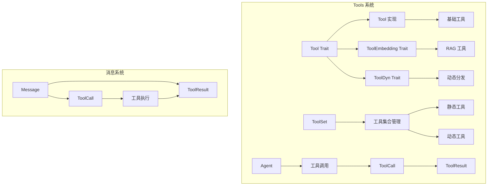
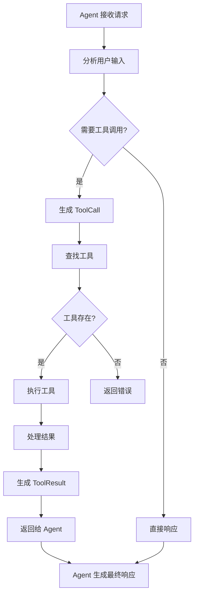
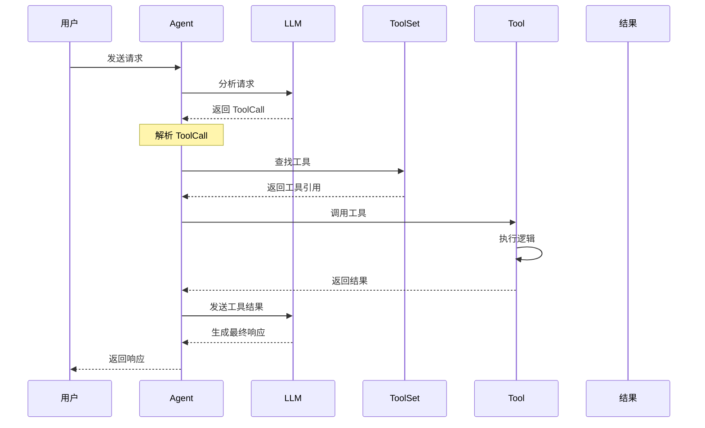
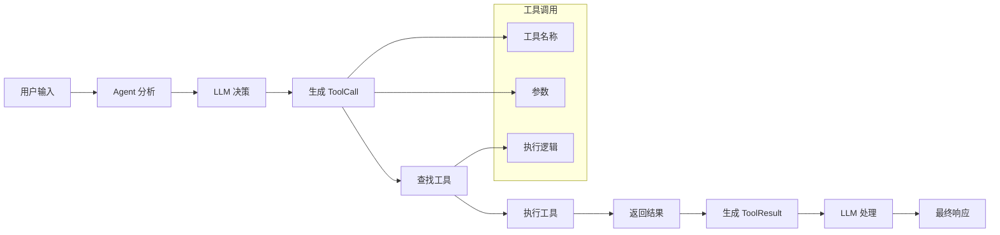
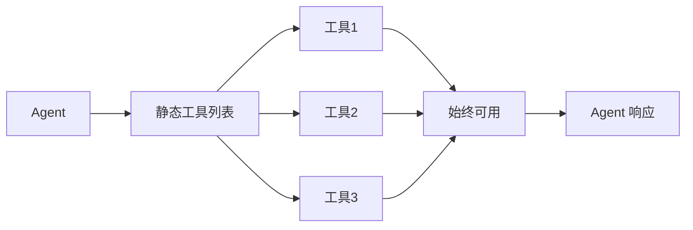
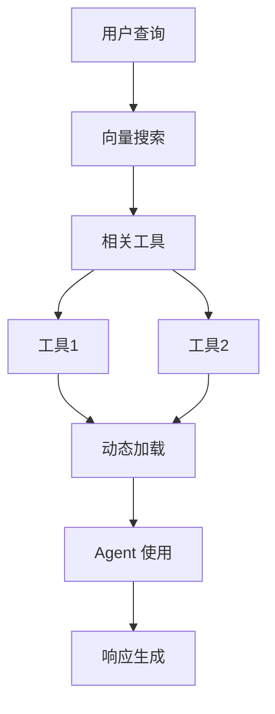
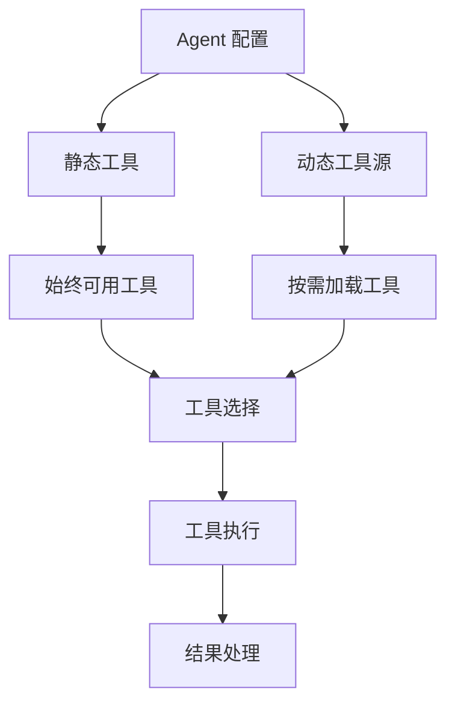
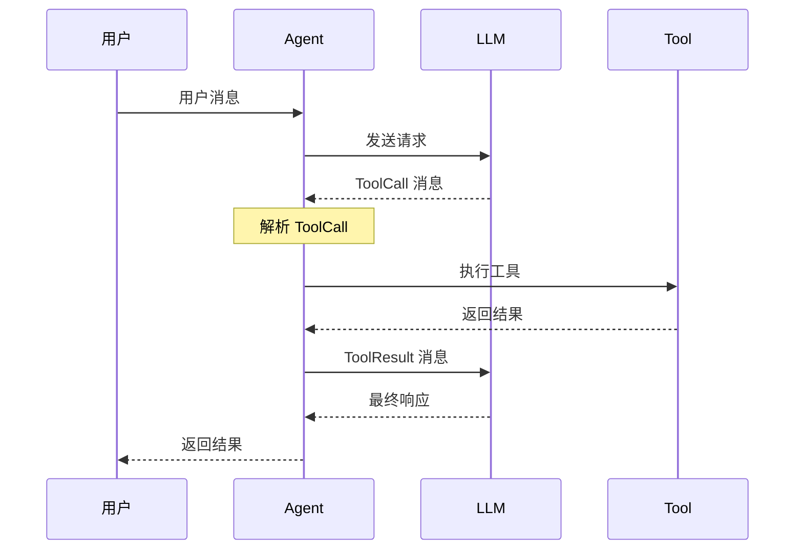

# Rig Tools 执行和协作流程详解

## 概述

Rig 的 Tools 系统是一个强大的工具调用框架，允许 LLM Agent 使用外部工具来扩展其能力。Tools 系统支持两种类型的工具：静态工具（Static Tools）和动态工具（Dynamic Tools），并且可以与向量存储集成实现 RAG 功能。

## Tools 核心概念

### 1. 基本架构



### 2. 核心组件

**Tool Trait**: 所有工具的基础接口
```rust
pub trait Tool: Sized + Send + Sync {
    const NAME: &'static str;
    type Error: std::error::Error + Send + Sync + 'static;
    type Args: for<'a> Deserialize<'a> + Send + Sync;
    type Output: Serialize;

    fn name(&self) -> String;
    fn definition(&self, _prompt: String) -> impl Future<Output = ToolDefinition> + Send + Sync;
    fn call(&self, args: Self::Args) -> impl Future<Output = Result<Self::Output, Self::Error>> + Send;
}
```

**ToolSet**: 工具集合管理
```rust
#[derive(Default)]
pub struct ToolSet {
    pub(crate) tools: HashMap<String, ToolType>,
}
```

## Tools 执行流程

### 1. 基本执行流程



### 2. 详细执行时序图



### 3. 工具调用数据流



## Tools 类型和实现

### 1. 基础工具（Basic Tool）

**基本工具结构**:
```rust
#[derive(Deserialize, Serialize)]
struct Calculator;

impl Tool for Calculator {
    const NAME: &'static str = "calculator";
    type Error = CalculatorError;
    type Args = CalculationArgs;
    type Output = f64;

    async fn definition(&self, _prompt: String) -> ToolDefinition {
        ToolDefinition {
            name: "calculator".to_string(),
            description: "Perform mathematical calculations".to_string(),
            parameters: serde_json::json!({
                "type": "object",
                "properties": {
                    "expression": {
                        "type": "string",
                        "description": "Mathematical expression to evaluate"
                    }
                },
                "required": ["expression"]
            })
        }
    }

    async fn call(&self, args: Self::Args) -> Result<Self::Output, Self::Error> {
        // 实现计算逻辑
        let result = evaluate_expression(&args.expression)?;
        Ok(result)
    }
}
```

### 2. RAG 工具（ToolEmbedding）

**RAG 工具结构**:
```rust
impl ToolEmbedding for Calculator {
    type InitError = CalculatorInitError;
    type Context = CalculatorConfig;
    type State = CalculatorState;

    fn embedding_docs(&self) -> Vec<String> {
        vec![
            "Perform mathematical calculations".to_string(),
            "Evaluate mathematical expressions".to_string(),
            "Calculate mathematical results".to_string(),
        ]
    }

    fn context(&self) -> Self::Context {
        CalculatorConfig {
            precision: 2,
            allow_complex: false,
        }
    }

    fn init(state: Self::State, context: Self::Context) -> Result<Self, Self::InitError> {
        Ok(Calculator {
            state,
            context,
        })
    }
}
```

### 3. 动态工具（ToolDyn）

**动态工具包装**:
```rust
pub trait ToolDyn: Send + Sync {
    fn name(&self) -> String;
    fn definition(&self, prompt: String) -> Pin<Box<dyn Future<Output = ToolDefinition> + Send + Sync + '_>>;
    fn call(&self, args: String) -> Pin<Box<dyn Future<Output = Result<String, ToolError>> + Send + '_>>;
}

impl<T: Tool> ToolDyn for T {
    fn name(&self) -> String {
        self.name()
    }

    fn definition(&self, prompt: String) -> Pin<Box<dyn Future<Output = ToolDefinition> + Send + Sync + '_>> {
        Box::pin(<Self as Tool>::definition(self, prompt))
    }

    fn call(&self, args: String) -> Pin<Box<dyn Future<Output = Result<String, ToolError>> + Send + '_>> {
        Box::pin(async move {
            let args: Self::Args = serde_json::from_str(&args)?;
            let result = <Self as Tool>::call(self, args).await?;
            serde_json::to_string(&result).map_err(ToolError::JsonError)
        })
    }
}
```

## Tools 协作模式

### 1. 静态工具协作



### 2. 动态工具协作



### 3. 混合工具协作



## 消息系统集成

### 1. 工具调用消息

**ToolCall 结构**:
```rust
#[derive(Clone, Debug, Deserialize, Serialize, PartialEq)]
pub struct ToolCall {
    pub id: String,
    pub call_id: Option<String>,
    pub function: ToolFunction,
}

#[derive(Clone, Debug, Deserialize, Serialize, PartialEq)]
pub struct ToolFunction {
    pub name: String,
    pub arguments: serde_json::Value,
}
```

**ToolResult 结构**:
```rust
#[derive(Clone, Debug, Deserialize, Serialize, PartialEq)]
pub struct ToolResult {
    pub id: String,
    pub call_id: Option<String>,
    pub content: OneOrMany<ToolResultContent>,
}

#[derive(Clone, Debug, Deserialize, Serialize, PartialEq)]
pub enum ToolResultContent {
    Text(Text),
    Image(Image),
    Audio(Audio),
    Document(Document),
}
```

### 2. 消息流程



## 实际使用示例

### 1. 基础工具实现

```rust
use rig::prelude::*;
use rig::tool::Tool;
use serde::{Deserialize, Serialize};
use serde_json::json;

#[derive(Deserialize)]
struct WeatherArgs {
    city: String,
    date: Option<String>,
}

#[derive(Debug, thiserror::Error)]
#[error("Weather API error: {0}")]
struct WeatherError(String);

#[derive(Deserialize, Serialize)]
struct WeatherTool;

impl Tool for WeatherTool {
    const NAME: &'static str = "get_weather";
    type Error = WeatherError;
    type Args = WeatherArgs;
    type Output = WeatherInfo;

    async fn definition(&self, _prompt: String) -> ToolDefinition {
        ToolDefinition {
            name: "get_weather".to_string(),
            description: "Get current weather information for a city".to_string(),
            parameters: json!({
                "type": "object",
                "properties": {
                    "city": {
                        "type": "string",
                        "description": "City name to get weather for"
                    },
                    "date": {
                        "type": "string",
                        "description": "Optional date for weather forecast (YYYY-MM-DD)"
                    }
                },
                "required": ["city"]
            })
        }
    }

    async fn call(&self, args: Self::Args) -> Result<Self::Output, Self::Error> {
        // 模拟天气 API 调用
        let weather = fetch_weather(&args.city, args.date.as_deref()).await
            .map_err(|e| WeatherError(e.to_string()))?;

        Ok(weather)
    }
}

#[derive(Serialize)]
struct WeatherInfo {
    city: String,
    temperature: f64,
    condition: String,
    humidity: u8,
}

async fn fetch_weather(city: &str, date: Option<&str>) -> Result<WeatherInfo, Box<dyn std::error::Error>> {
    // 这里应该是实际的天气 API 调用
    // 为了示例，返回模拟数据
    Ok(WeatherInfo {
        city: city.to_string(),
        temperature: 22.5,
        condition: "Sunny".to_string(),
        humidity: 65,
    })
}
```

### 2. RAG 工具实现

```rust
use rig::prelude::*;
use rig::tool::{Tool, ToolEmbedding};
use serde::{Deserialize, Serialize};

#[derive(Deserialize)]
struct SearchArgs {
    query: String,
    max_results: Option<u32>,
}

#[derive(Debug, thiserror::Error)]
#[error("Search error: {0}")]
struct SearchError(String);

#[derive(Debug, thiserror::Error)]
#[error("Init error: {0}")]
struct InitError(String);

#[derive(Deserialize, Serialize)]
struct SearchConfig {
    api_key: String,
    base_url: String,
    timeout: u64,
}

#[derive(Deserialize, Serialize)]
struct SearchState {
    client: reqwest::Client,
}

#[derive(Deserialize, Serialize)]
struct SearchTool {
    state: SearchState,
    config: SearchConfig,
}

impl Tool for SearchTool {
    const NAME: &'static str = "web_search";
    type Error = SearchError;
    type Args = SearchArgs;
    type Output = Vec<SearchResult>;

    async fn definition(&self, _prompt: String) -> ToolDefinition {
        ToolDefinition {
            name: "web_search".to_string(),
            description: "Search the web for information".to_string(),
            parameters: json!({
                "type": "object",
                "properties": {
                    "query": {
                        "type": "string",
                        "description": "Search query"
                    },
                    "max_results": {
                        "type": "number",
                        "description": "Maximum number of results to return"
                    }
                },
                "required": ["query"]
            })
        }
    }

    async fn call(&self, args: Self::Args) -> Result<Self::Output, Self::Error> {
        let results = perform_search(&self.state.client, &self.config, &args.query, args.max_results).await
            .map_err(|e| SearchError(e.to_string()))?;

        Ok(results)
    }
}

impl ToolEmbedding for SearchTool {
    type InitError = InitError;
    type Context = SearchConfig;
    type State = SearchState;

    fn embedding_docs(&self) -> Vec<String> {
        vec![
            "Search the web for information".to_string(),
            "Find relevant web pages and content".to_string(),
            "Perform internet searches".to_string(),
            "Retrieve web search results".to_string(),
        ]
    }

    fn context(&self) -> Self::Context {
        self.config.clone()
    }

    fn init(state: Self::State, context: Self::Context) -> Result<Self, Self::InitError> {
        Ok(SearchTool { state, config: context })
    }
}

#[derive(Serialize)]
struct SearchResult {
    title: String,
    url: String,
    snippet: String,
}

async fn perform_search(
    client: &reqwest::Client,
    config: &SearchConfig,
    query: &str,
    max_results: Option<u32>,
) -> Result<Vec<SearchResult>, Box<dyn std::error::Error>> {
    // 这里应该是实际的搜索 API 调用
    // 为了示例，返回模拟数据
    Ok(vec![
        SearchResult {
            title: "Search Result 1".to_string(),
            url: "https://example.com/1".to_string(),
            snippet: "This is a sample search result...".to_string(),
        },
        SearchResult {
            title: "Search Result 2".to_string(),
            url: "https://example.com/2".to_string(),
            snippet: "Another sample search result...".to_string(),
        },
    ])
}
```

### 3. 工具集合管理

```rust
use rig::prelude::*;
use rig::tool::{Tool, ToolSet, ToolSetBuilder};

#[tokio::main]
async fn main() -> Result<(), anyhow::Error> {
    // 创建工具集合
    let mut toolset = ToolSet::builder()
        .static_tool(Calculator)
        .static_tool(WeatherTool)
        .dynamic_tool(SearchTool)
        .build();

    // 或者使用 from_tools 方法
    let tools = vec![
        Box::new(Calculator) as Box<dyn ToolDyn>,
        Box::new(WeatherTool) as Box<dyn ToolDyn>,
    ];
    let toolset = ToolSet::from_tools(tools);

    // 添加新工具
    toolset.add_tool(NewTool);

    // 检查工具是否存在
    if toolset.contains("calculator") {
        println!("Calculator tool is available");
    }

    // 获取工具定义
    let definitions = toolset.get_tool_definitions().await?;
    for def in definitions {
        println!("Tool: {} - {}", def.name, def.description);
    }

    // 调用工具
    let result = toolset.call("calculator", r#"{"expression": "2 + 2"}"#).await?;
    println!("Calculator result: {}", result);

    Ok(())
}
```

### 4. Agent 与工具集成

```rust
use rig::prelude::*;
use rig::tool::Tool;

#[tokio::main]
async fn main() -> Result<(), anyhow::Error> {
    let openai_client = openai::Client::from_env();

    // 创建带工具的 Agent
    let agent = openai_client
        .agent(openai::GPT_4O)
        .preamble("You are a helpful assistant with access to various tools. Use them when appropriate to help users.")
        .tool(Calculator)
        .tool(WeatherTool)
        .tool(SearchTool)
        .build();

    // 使用 Agent
    let response = agent.prompt("What's the weather like in Beijing and calculate 15 * 23?").await?;
    println!("Agent response: {}", response);

    Ok(())
}
```

### 5. 动态工具与 RAG 集成

```rust
use rig::prelude::*;
use rig::embeddings::EmbeddingsBuilder;
use rig::vector_store::in_memory_store::InMemoryVectorStore;

#[tokio::main]
async fn main() -> Result<(), anyhow::Error> {
    let openai_client = openai::Client::from_env();

    // 创建动态工具集合
    let toolset = ToolSet::builder()
        .dynamic_tool(SearchTool)
        .dynamic_tool(WeatherTool)
        .build();

    // 创建向量存储
    let embedding_model = openai_client.embedding_model(openai::TEXT_EMBEDDING_ADA_002);
    let embeddings = EmbeddingsBuilder::new(embedding_model.clone())
        .documents(toolset.schemas()?)?
        .build()
        .await?;

    let vector_store = InMemoryVectorStore::from_documents_with_id_f(embeddings, |tool| tool.name.clone());
    let index = vector_store.index(embedding_model);

    // 创建 RAG Agent
    let rag_agent = openai_client
        .agent(openai::GPT_4O)
        .preamble("You are a helpful assistant with access to dynamic tools. Use them based on the user's needs.")
        .dynamic_tools(2, index, toolset) // 每次最多加载 2 个相关工具
        .build();

    // 使用 RAG Agent
    let response = rag_agent.prompt("I need to search for information about Rust programming and check the weather in Tokyo").await?;
    println!("RAG Agent response: {}", response);

    Ok(())
}
```

### 6. 自定义工具错误处理

```rust
use rig::prelude::*;
use rig::tool::Tool;
use serde::{Deserialize, Serialize};

#[derive(Debug, thiserror::Error)]
pub enum CustomToolError {
    #[error("Network error: {0}")]
    Network(String),
    #[error("Validation error: {0}")]
    Validation(String),
    #[error("API error: {0}")]
    Api(String),
}

impl From<reqwest::Error> for CustomToolError {
    fn from(err: reqwest::Error) -> Self {
        CustomToolError::Network(err.to_string())
    }
}

impl From<serde_json::Error> for CustomToolError {
    fn from(err: serde_json::Error) -> Self {
        CustomToolError::Validation(err.to_string())
    }
}

#[derive(Deserialize)]
struct ApiArgs {
    endpoint: String,
    data: Option<serde_json::Value>,
}

#[derive(Serialize)]
struct ApiResponse {
    success: bool,
    data: serde_json::Value,
}

#[derive(Deserialize, Serialize)]
struct ApiTool;

impl Tool for ApiTool {
    const NAME: &'static str = "api_call";
    type Error = CustomToolError;
    type Args = ApiArgs;
    type Output = ApiResponse;

    async fn definition(&self, _prompt: String) -> ToolDefinition {
        ToolDefinition {
            name: "api_call".to_string(),
            description: "Make API calls to external services".to_string(),
            parameters: json!({
                "type": "object",
                "properties": {
                    "endpoint": {
                        "type": "string",
                        "description": "API endpoint to call"
                    },
                    "data": {
                        "type": "object",
                        "description": "Data to send with the request"
                    }
                },
                "required": ["endpoint"]
            })
        }
    }

    async fn call(&self, args: Self::Args) -> Result<Self::Output, Self::Error> {
        let client = reqwest::Client::new();

        let response = if let Some(data) = args.data {
            client.post(&args.endpoint)
                .json(&data)
                .send()
                .await?
        } else {
            client.get(&args.endpoint)
                .send()
                .await?
        };

        if !response.status().is_success() {
            return Err(CustomToolError::Api(format!("HTTP {}: {}", response.status(), response.text().await?)));
        }

        let data: serde_json::Value = response.json().await?;
        Ok(ApiResponse {
            success: true,
            data,
        })
    }
}
```

### 7. 工具链式调用

```rust
use rig::prelude::*;
use rig::tool::{Tool, ToolSet};
use serde::{Deserialize, Serialize};

#[derive(Deserialize)]
struct ChainArgs {
    steps: Vec<String>,
    initial_data: serde_json::Value,
}

#[derive(Serialize)]
struct ChainResult {
    final_result: serde_json::Value,
    steps_executed: Vec<String>,
}

#[derive(Deserialize, Serialize)]
struct ToolChain;

impl Tool for ToolChain {
    const NAME: &'static str = "tool_chain";
    type Error = anyhow::Error;
    type Args = ChainArgs;
    type Output = ChainResult;

    async fn definition(&self, _prompt: String) -> ToolDefinition {
        ToolDefinition {
            name: "tool_chain".to_string(),
            description: "Execute a chain of tools in sequence".to_string(),
            parameters: json!({
                "type": "object",
                "properties": {
                    "steps": {
                        "type": "array",
                        "items": {"type": "string"},
                        "description": "List of tool names to execute in sequence"
                    },
                    "initial_data": {
                        "type": "object",
                        "description": "Initial data to pass to the first tool"
                    }
                },
                "required": ["steps", "initial_data"]
            })
        }
    }

    async fn call(&self, args: Self::Args) -> Result<Self::Output, Self::Error> {
        let mut current_data = args.initial_data;
        let mut steps_executed = Vec::new();

        for step in args.steps {
            // 这里应该根据工具名称查找并执行相应的工具
            // 为了示例，我们只是记录步骤
            steps_executed.push(step.clone());

            // 模拟工具执行
            current_data = serde_json::json!({
                "step": step,
                "input": current_data,
                "output": format!("Processed by {}", step)
            });
        }

        Ok(ChainResult {
            final_result: current_data,
            steps_executed,
        })
    }
}
```

## 工具开发最佳实践

### 1. 错误处理

```rust
// 使用 thiserror 创建自定义错误类型
#[derive(Debug, thiserror::Error)]
pub enum ToolError {
    #[error("Invalid input: {0}")]
    InvalidInput(String),
    #[error("External service error: {0}")]
    ExternalService(#[from] reqwest::Error),
    #[error("Rate limit exceeded: retry after {0} seconds")]
    RateLimit(u64),
}

// 在工具实现中提供有意义的错误信息
impl Tool for MyTool {
    // ... 其他实现

    async fn call(&self, args: Self::Args) -> Result<Self::Output, Self::Error> {
        // 验证输入
        if args.value < 0 {
            return Err(ToolError::InvalidInput("Value must be positive".to_string()));
        }

        // 处理外部服务调用
        let result = external_service_call(args.value).await
            .map_err(|e| ToolError::ExternalService(e))?;

        Ok(result)
    }
}
```

### 2. 参数验证

```rust
use serde::{Deserialize, Serialize};
use validator::{Validate, ValidationError};

#[derive(Deserialize, Validate)]
struct ToolArgs {
    #[validate(length(min = 1, max = 100))]
    query: String,

    #[validate(range(min = 1, max = 100))]
    limit: u32,

    #[validate(email)]
    email: Option<String>,
}

impl Tool for ValidatedTool {
    // ... 其他实现

    async fn call(&self, args: Self::Args) -> Result<Self::Output, Self::Error> {
        // 验证参数
        args.validate()
            .map_err(|e| ToolError::ValidationError(e.to_string()))?;

        // 执行工具逻辑
        let result = self.process(args).await?;
        Ok(result)
    }
}
```

### 3. 异步处理

```rust
use tokio::time::{sleep, Duration};
use futures::future::join_all;

impl Tool for AsyncTool {
    // ... 其他实现

    async fn call(&self, args: Self::Args) -> Result<Self::Output, Self::Error> {
        // 并行处理多个任务
        let futures: Vec<_> = args.items
            .into_iter()
            .map(|item| self.process_item(item))
            .collect();

        let results = join_all(futures).await;

        // 处理结果
        let successful_results: Vec<_> = results
            .into_iter()
            .filter_map(|r| r.ok())
            .collect();

        Ok(AsyncResult {
            processed: successful_results.len(),
            results: successful_results,
        })
    }

    async fn process_item(&self, item: String) -> Result<String, Self::Error> {
        // 模拟异步处理
        sleep(Duration::from_millis(100)).await;
        Ok(format!("Processed: {}", item))
    }
}
```

## 总结

Rig 的 Tools 系统提供了：

1. **灵活的工具定义**: 支持基础工具和 RAG 工具两种类型
2. **类型安全**: 编译时类型检查，确保工具调用的正确性
3. **动态工具加载**: 基于向量搜索的动态工具发现和加载
4. **异步支持**: 全面支持 async/await，适合高并发场景
5. **错误处理**: 完善的错误处理机制，支持自定义错误类型
6. **消息集成**: 与 Rig 的消息系统无缝集成
7. **工具管理**: 强大的工具集合管理功能

这种设计使得开发者能够：

- 快速创建和集成各种外部服务工具
- 实现智能的工具选择和调用
- 构建复杂的工具链和工作流
- 通过 RAG 实现动态工具发现
- 创建可扩展和可维护的工具生态系统

Tools 系统特别适合构建需要调用外部 API、执行复杂计算、访问数据库、处理文件等功能的 AI 应用。
