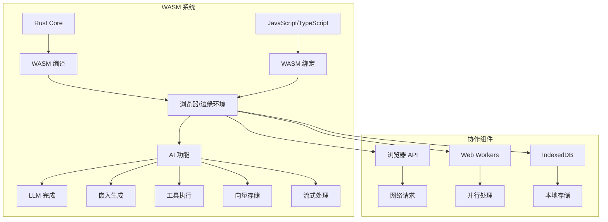
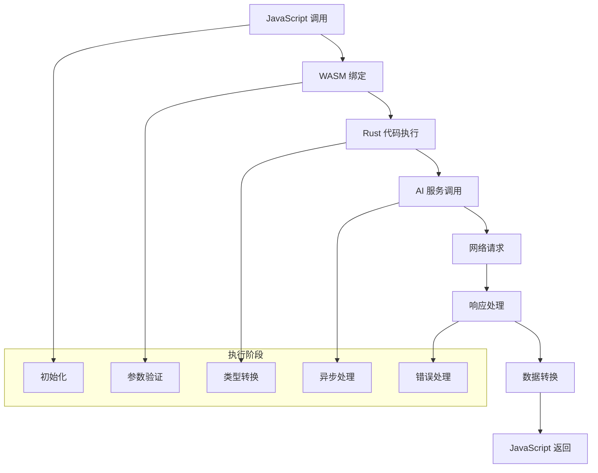
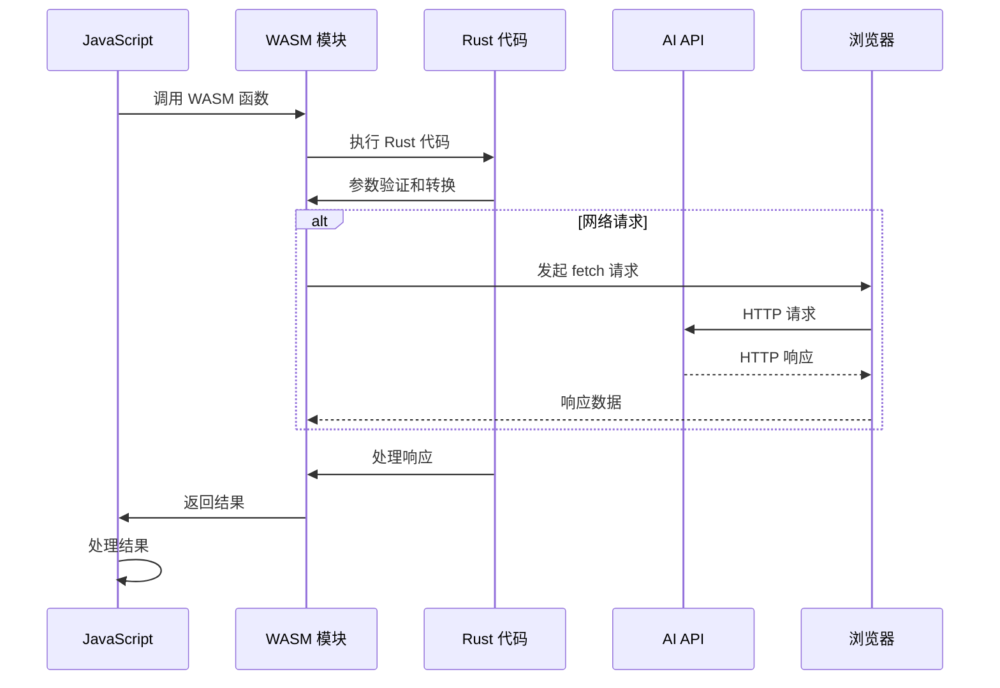
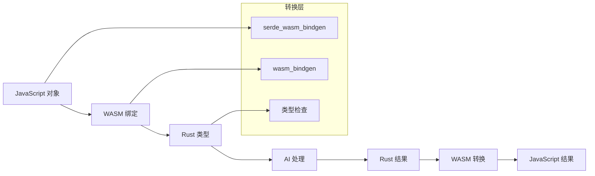
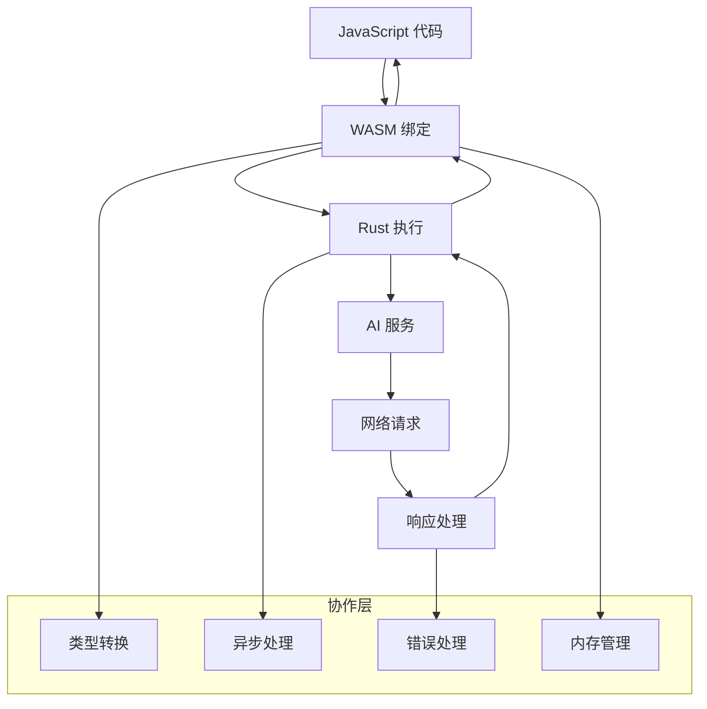
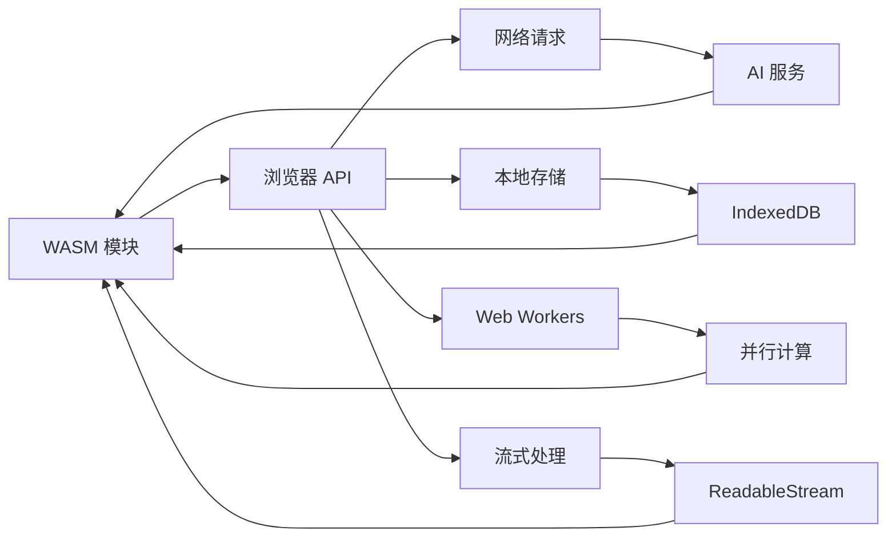
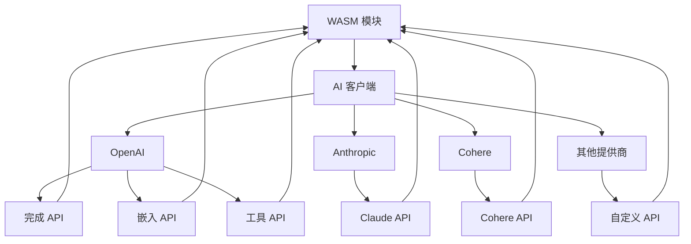

# Rig WASM 执行和协作流程详解

## 概述

Rig WASM 是 Rig 库的 WebAssembly 版本，允许在浏览器和边缘环境中运行 Rig 的 AI 功能。WASM 版本提供了与 Rust 原生版本相同的功能，包括 LLM 完成、嵌入、工具使用、向量存储等，同时保持了高性能和类型安全。

## WASM 核心概念

### 1. 基本架构



### 2. 核心组件

**WASM 模块**: 编译后的 Rust 代码
```rust
#[wasm_bindgen]
pub struct OpenAIAgent(Agent<rig::providers::openai::responses_api::ResponsesCompletionModel>);
```

**JavaScript 绑定**: 通过 wasm_bindgen 生成的接口
```typescript
import { Agent } from "rig-wasm/openai";
```

**类型转换**: Rust 和 JavaScript 之间的数据转换
```rust
impl From<rig::message::Message> for Message {
    fn from(value: rig::message::Message) -> Self {
        Self(value)
    }
}
```

## WASM 执行流程

### 1. 基本执行流程



### 2. 详细执行时序图



### 3. 数据流转换图



## WASM 类型和实现

### 1. 基础类型绑定

**消息类型**:
```rust
#[wasm_bindgen]
#[derive(Clone)]
pub struct Message(rig::message::Message);

impl From<Message> for rig::message::Message {
    fn from(value: Message) -> Self {
        value.0
    }
}
```

**文档类型**:
```rust
#[wasm_bindgen]
#[derive(Clone)]
pub struct Document(rig::completion::Document);

#[wasm_bindgen]
impl Document {
    #[wasm_bindgen(constructor)]
    pub fn new(id: &str, text: &str) -> Self {
        Self(rig::completion::Document {
            id: id.to_string(),
            text: text.to_string(),
            additional_props: HashMap::new(),
        })
    }
}
```

**工具定义**:
```rust
#[wasm_bindgen]
#[derive(Clone)]
pub struct ToolDefinition(rig::completion::ToolDefinition);

#[wasm_bindgen]
impl ToolDefinition {
    #[wasm_bindgen(constructor)]
    pub fn new(args: JsValue) -> JsResult<Self> {
        let args: rig::completion::ToolDefinition =
            serde_wasm_bindgen::from_value(args).map_err(|err| {
                JsError::new(format!("ToolDefinition creation error: {err}").as_ref())
            })?;
        Ok(Self(args))
    }
}
```

### 2. 完成请求类型

**完成请求结构**:
```rust
#[wasm_bindgen]
pub struct CompletionRequest {
    preamble: Option<String>,
    messages: Vec<Message>,
    documents: Vec<Document>,
    tools: Vec<ToolDefinition>,
    temperature: Option<f64>,
    max_tokens: Option<u64>,
    additional_params: Option<serde_json::Value>,
}

#[wasm_bindgen]
impl CompletionRequest {
    #[wasm_bindgen(constructor)]
    pub fn new(opts: JsCompletionOpts) -> JsResult<Self> {
        // 从 JavaScript 对象解析参数
        let preamble = Reflect::get(&opts, &JsValue::from_str("preamble"))
            .ok()
            .and_then(|x| x.as_string());

        let messages = Reflect::get(&opts, &JsValue::from_str("messages"))
            .map_err(|_| JsError::new("completion_request.messages should be an array of messages"))?;
        let messages = convert_messages_from_jsvalue(messages)?;

        // ... 其他参数解析

        Ok(Self {
            preamble,
            messages,
            documents,
            tools,
            temperature,
            max_tokens,
            additional_params,
        })
    }
}
```

### 3. 工具系统绑定

**JavaScript 工具绑定**:
```rust
#[wasm_bindgen]
pub struct JsTool {
    inner: SendWrapper<JsValue>,
}

impl rig::tool::Tool for JsTool {
    type Args = serde_json::Value;
    type Error = rig::tool::ToolError;
    type Output = serde_json::Value;

    const NAME: &str = "JS_TOOL";

    fn name(&self) -> String {
        let res: &JsToolObject = self.inner.unchecked_ref();
        res.name()
    }

    fn definition(
        &self,
        prompt: String,
    ) -> impl Future<Output = rig::completion::ToolDefinition> + Send + Sync {
        let func = js_sys::Reflect::get(&self.inner, &JsValue::from_str("definition"))
            .expect("tool must have a definition method")
            .unchecked_into::<js_sys::Function>();

        let this = &self.inner;
        let prompt = JsValue::from_str(&prompt);
        let res = func.call1(this, &prompt).expect("definition call failed");

        let value: rig::completion::ToolDefinition = serde_wasm_bindgen::from_value(res)
            .inspect_err(|x| println!("Error: {x}"))
            .unwrap();

        async { value }
    }

    fn call(
        &self,
        args: Self::Args,
    ) -> impl Future<Output = Result<Self::Output, Self::Error>> + Send {
        // 异步调用 JavaScript 工具函数
        let (result_tx, result_rx) = futures::channel::oneshot::channel();
        let js_args = serde_wasm_bindgen::to_value(&args).expect("This should be a JSON object!");

        let func = self.inner.clone();
        spawn_local(async move {
            // 调用 JavaScript 工具函数
            let call_fn = js_sys::Reflect::get(&func, &JsValue::from_str("call"))
                .expect("tool.call should exist")
                .unchecked_into::<js_sys::Function>();

            let promise = call_fn.call1(&func, &js_args).expect("tool.call failed");
            let promise = promise.dyn_into::<js_sys::Promise>().expect("tool.call should return a Promise");

            let res = JsFuture::from(promise).await.expect("Promise should resolve");
            let res: serde_json::Value = serde_wasm_bindgen::from_value(res).expect("Result should be JSON");

            let _ = result_tx.send(res);
        });

        async {
            result_rx.await.map_err(|_| ToolError::ToolCallError("Future was cancelled".into()))
        }
    }
}
```

### 4. 向量存储绑定

**JavaScript 向量存储绑定**:
```rust
#[wasm_bindgen]
pub struct JsVectorStore {
    inner: SendWrapper<JsValue>,
}

impl rig::vector_store::VectorStoreIndex for JsVectorStore {
    fn top_n<T: for<'a> Deserialize<'a> + Send>(
        &self,
        req: VectorSearchRequest,
    ) -> impl std::future::Future<
        Output = Result<Vec<(f64, String, T)>, rig::vector_store::VectorStoreError>,
    > + Send {
        let (result_tx, result_rx) = futures::channel::oneshot::channel();
        let inner = self.inner.clone();

        spawn_local(async move {
            // 调用 JavaScript 向量存储函数
            let req = serde_wasm_bindgen::to_value(&req).expect("Request should be serializable");
            let call_fn = js_sys::Reflect::get(&inner, &JsValue::from_str("topN"))
                .expect("topN should exist")
                .unchecked_into::<js_sys::Function>();

            let promise = call_fn.call1(&inner, &req).expect("topN call failed");
            let promise = promise.dyn_into::<js_sys::Promise>().expect("topN should return a Promise");

            let js_result = JsFuture::from(promise).await.expect("Promise should resolve");

            // 处理 JavaScript 返回的结果
            let arr = Array::from(&js_result).into_iter();
            let mut out: Vec<(f64, String, serde_json::Value)> = Vec::new();

            for tuple in arr {
                let tuple = Array::from(&tuple);
                let score = tuple.get(0).as_f64().expect("Score should be a number");
                let id = tuple.get(1).as_string().expect("ID should be a string");
                let obj: serde_json::Value = serde_wasm_bindgen::from_value(tuple.get(2))
                    .expect("Document should be JSON");

                out.push((score, id, obj));
            }

            let _ = result_tx.send(out);
        });

        async {
            result_rx.await.map_err(|_| VectorStoreError::DatastoreError("Future was cancelled".into()))
        }
    }
}
```

## WASM 协作模式

### 1. 与 JavaScript 协作



### 2. 与浏览器 API 协作



### 3. 与 AI 服务协作



## 实际使用示例

### 1. 基础 Agent 使用

**TypeScript 代码**:
```typescript
import { Agent } from "rig-wasm/openai";
import { initPanicHook } from "rig-wasm/utils";

// 初始化 panic hook
initPanicHook();

async function basicAgentExample() {
    const apiKey = process.env.OPENAI_API_KEY;
    if (!apiKey) {
        throw new Error("OPENAI_API_KEY not set");
    }

    try {
        // 创建 OpenAI Agent
        const agent = new Agent({
            apiKey: apiKey,
            model: "gpt-4o",
            preamble: "You are a helpful assistant.",
        });

        // 发送提示
        const prompt = "Please write the first 100 words of Lorem Ipsum.";
        console.log(`Prompt: ${prompt}`);

        const response = await agent.prompt(prompt);
        console.log(`Response: ${response}`);

    } catch (error) {
        if (error instanceof Error) {
            console.error(`Error: ${error.message}`);
        }
    }
}

// 运行示例
basicAgentExample();
```

**Rust WASM 实现**:
```rust
#[wasm_bindgen]
impl OpenAIAgent {
    #[wasm_bindgen(constructor)]
    pub fn new(opts: JsAgentOpts) -> JsResult<Self> {
        let api_key = Reflect::get(&opts, &JsValue::from_str("apiKey"))
            .map_err(|_| JsError::new("failed to get apiKey"))?
            .as_string()
            .ok_or(JsError::new("apiKey property of Agent is required"))?;

        let model = Reflect::get(&opts, &JsValue::from_str("model"))
            .map_err(|_| JsError::new("failed to get model"))?
            .as_string()
            .ok_or(JsError::new("model property of Agent is required"))?;

        let preamble = Reflect::get(&opts, &JsValue::from_str("preamble"))
            .ok()
            .and_then(|v| v.as_string());

        let mut agent = rig::providers::openai::Client::new(&api_key).agent(&model);

        if let Some(preamble) = preamble {
            agent = agent.preamble(&preamble);
        }

        Ok(Self(agent.build()))
    }

    pub async fn prompt(&self, prompt: &str) -> JsResult<String> {
        self.0
            .prompt(prompt)
            .await
            .map_err(|x| JsError::new(x.to_string().as_ref()))
    }
}
```

### 2. 带工具的 Agent

**TypeScript 代码**:
```typescript
import { Agent } from "rig-wasm/openai";

// 定义 JavaScript 工具
const counter = {
    counter: 5324,
    name: function () {
        return "counter";
    },
    definition: function (_prompt: string) {
        return {
            name: "counter",
            description: "a counter that can only be incremented",
            parameters: {
                $schema: "https://json-schema.org/draft/2020-12/schema",
                title: "ToolDefinition",
                type: "object",
                properties: {},
                required: [],
            },
        };
    },
    call: async function (args: any) {
        this.counter += 1;
        return { result: this.counter };
    },
};

async function toolAgentExample() {
    const apiKey = process.env.OPENAI_API_KEY;
    if (!apiKey) {
        throw new Error("OPENAI_API_KEY not set");
    }

    try {
        // 创建带工具的 Agent
        const agent = new Agent({
            apiKey: apiKey,
            model: "gpt-4o",
            tools: [counter],
        });

        const prompt = "Please increment the counter by 1 and let me know what the resulting number is.";
        console.log(`Prompt: ${prompt}`);

        const response = await agent.prompt(prompt);
        console.log(`Response: ${response}`);

    } catch (error) {
        if (error instanceof Error) {
            console.error(`Error: ${error.message}`);
        }
    }
}

// 运行示例
toolAgentExample();
```

### 3. 流式完成

**TypeScript 代码**:
```typescript
import { Agent } from "rig-wasm/openai";
import { decodeReadableStream, RawStreamingChoice } from "rig-wasm/streaming";

async function streamingExample() {
    const apiKey = process.env.OPENAI_API_KEY;
    if (!apiKey) {
        throw new Error("OPENAI_API_KEY not set");
    }

    try {
        const agent = new Agent({
            apiKey: apiKey,
            model: "gpt-4o",
        });

        const prompt = "Write a short story about a robot learning to paint.";
        console.log(`Prompt: ${prompt}`);

        // 获取流式响应
        const stream = await agent.prompt_stream(prompt);

        let aggregatedText = "";
        for await (const chunk of decodeReadableStream(stream)) {
            if (chunk.text !== null && chunk.text !== aggregatedText) {
                aggregatedText += chunk.text;
                process.stdout.write(chunk.text);
            }
        }

        console.log(`\nComplete story: ${aggregatedText}`);

    } catch (error) {
        if (error instanceof Error) {
            console.error(`Error: ${error.message}`);
        }
    }
}

// 运行示例
streamingExample();
```

**Rust WASM 实现**:
```rust
#[wasm_bindgen]
impl OpenAIAgent {
    pub async fn prompt_stream(
        &self,
        prompt: &str,
    ) -> Result<wasm_streams::readable::sys::ReadableStream, JsValue> {
        let stream = self.0.stream_prompt(prompt).await.map_err(|x| {
            JsError::new(format!("Error while streaming response: {x}").as_ref())
        })?;

        let js_stream = stream
            .map_ok(|x| {
                serde_wasm_bindgen::to_value(&x)
                    .map_err(|e| JsValue::from_str(&format!("Failed streaming: {e}")))
            })
            .map(|result| match result {
                Ok(Ok(js)) => Ok(js),
                Ok(Err(js_err)) => Err(js_err),
                Err(e) => Err(JsValue::from_str(&format!("Stream error: {e}"))),
            });

        Ok(ReadableStream::from_stream(js_stream).into_raw())
    }
}
```

### 4. 嵌入和向量存储

**TypeScript 代码**:
```typescript
import { EmbeddingModel } from "rig-wasm/openai";
import { QdrantAdapter } from "rig-wasm/qdrant";

async function embeddingExample() {
    const apiKey = process.env.OPENAI_API_KEY;
    if (!apiKey) {
        throw new Error("OPENAI_API_KEY not set");
    }

    try {
        // 创建嵌入模型
        const model = new EmbeddingModel({
            apiKey: apiKey,
            modelName: "text-embedding-3-small",
        });

        // 生成嵌入
        let embedding = await model.embedText("hello world!");
        console.log(`Embedding length: ${embedding.vec.length}`);
        console.log(`Embedded text: ${embedding.document}`);

        // 批量嵌入
        let embeddings = await model.embedTexts(["hello", "world", "example"]);
        console.log(`Generated ${embeddings.length} embeddings`);

        // 使用 Qdrant 向量存储
        let adapter = new QdrantAdapter("test_collection", model, {
            url: "http://127.0.0.1:6333",
        });

        await adapter.init(1536);

        let points = [
            {
                id: 1,
                vector: embedding.vec,
                payload: {
                    document: embedding.document,
                },
            },
        ];

        await adapter.insertDocuments(points);
        console.log(`Document successfully inserted`);

    } catch (error) {
        if (error instanceof Error) {
            console.error(`Error: ${error.message}`);
        }
    }
}

// 运行示例
embeddingExample();
```

### 5. 多轮对话

**TypeScript 代码**:
```typescript
import { Agent } from "rig-wasm/openai";
import { Message } from "rig-wasm/completion";

async function multiTurnChatExample() {
    const apiKey = process.env.OPENAI_API_KEY;
    if (!apiKey) {
        throw new Error("OPENAI_API_KEY not set");
    }

    try {
        const agent = new Agent({
            apiKey: apiKey,
            model: "gpt-4o",
            preamble: "You are a helpful coding assistant.",
        });

        // 第一轮对话
        const firstPrompt = "Hello! I'm learning Rust. Can you help me?";
        console.log(`First prompt: ${firstPrompt}`);

        const firstResponse = await agent.prompt(firstPrompt);
        console.log(`First response: ${firstResponse}`);

        // 第二轮对话
        const secondPrompt = "What are the basic concepts I should start with?";
        const messages = [
            {
                role: "user",
                content: [
                    {
                        text: firstPrompt,
                        type: "text",
                    },
                ],
            },
            {
                role: "assistant",
                content: [
                    {
                        text: firstResponse,
                        type: "text",
                    },
                ],
            },
        ];

        console.log(`Second prompt: ${secondPrompt}`);
        const secondResponse = await agent.chat(secondPrompt, messages);
        console.log(`Second response: ${secondResponse}`);

    } catch (error) {
        if (error instanceof Error) {
            console.error(`Error: ${error.message}`);
        }
    }
}

// 运行示例
multiTurnChatExample();
```

### 6. 自定义工具集成

**TypeScript 代码**:
```typescript
import { Agent } from "rig-wasm/openai";

// 自定义计算器工具
const calculator = {
    name: function () {
        return "calculator";
    },
    definition: function (_prompt: string) {
        return {
            name: "calculator",
            description: "A simple calculator that can perform basic arithmetic operations",
            parameters: {
                $schema: "https://json-schema.org/draft/2020-12/schema",
                title: "Calculator",
                type: "object",
                properties: {
                    operation: {
                        type: "string",
                        enum: ["add", "subtract", "multiply", "divide"],
                        description: "The arithmetic operation to perform"
                    },
                    a: {
                        type: "number",
                        description: "First number"
                    },
                    b: {
                        type: "number",
                        description: "Second number"
                    }
                },
                required: ["operation", "a", "b"]
            },
        };
    },
    call: async function (args: any) {
        const { operation, a, b } = args;

        switch (operation) {
            case "add":
                return { result: a + b };
            case "subtract":
                return { result: a - b };
            case "multiply":
                return { result: a * b };
            case "divide":
                if (b === 0) {
                    throw new Error("Division by zero");
                }
                return { result: a / b };
            default:
                throw new Error(`Unknown operation: ${operation}`);
        }
    },
};

// 自定义天气工具
const weather = {
    name: function () {
        return "weather";
    },
    definition: function (_prompt: string) {
        return {
            name: "weather",
            description: "Get weather information for a location",
            parameters: {
                $schema: "https://json-schema.org/draft/2020-12/schema",
                title: "Weather",
                type: "object",
                properties: {
                    location: {
                        type: "string",
                        description: "City or location name"
                    }
                },
                required: ["location"]
            },
        };
    },
    call: async function (args: any) {
        const { location } = args;

        // 模拟天气 API 调用
        const weatherData = {
            location: location,
            temperature: Math.floor(Math.random() * 30) + 10,
            condition: ["Sunny", "Cloudy", "Rainy", "Snowy"][Math.floor(Math.random() * 4)],
            humidity: Math.floor(Math.random() * 40) + 40
        };

        return weatherData;
    },
};

async function customToolsExample() {
    const apiKey = process.env.OPENAI_API_KEY;
    if (!apiKey) {
        throw new Error("OPENAI_API_KEY not set");
    }

    try {
        const agent = new Agent({
            apiKey: apiKey,
            model: "gpt-4o",
            tools: [calculator, weather],
            preamble: "You are a helpful assistant with access to a calculator and weather information.",
        });

        const prompt = "What's 15 * 23? Also, what's the weather like in Tokyo?";
        console.log(`Prompt: ${prompt}`);

        const response = await agent.prompt(prompt);
        console.log(`Response: ${response}`);

    } catch (error) {
        if (error instanceof Error) {
            console.error(`Error: ${error.message}`);
        }
    }
}

// 运行示例
customToolsExample();
```

### 7. 向量存储集成

**TypeScript 代码**:
```typescript
import { EmbeddingModel } from "rig-wasm/openai";
import { Agent } from "rig-wasm/openai";

// 自定义向量存储实现
class CustomVectorStore {
    private embeddings: Map<string, { vector: number[], text: string }> = new Map();
    private model: EmbeddingModel;

    constructor(model: EmbeddingModel) {
        this.model = model;
    }

    async addDocument(id: string, text: string) {
        const embedding = await this.model.embedText(text);
        this.embeddings.set(id, {
            vector: embedding.vec,
            text: text
        });
    }

    async search(query: string, topN: number = 5) {
        const queryEmbedding = await this.model.embedText(query);

        // 简单的余弦相似度搜索
        const results = Array.from(this.embeddings.entries())
            .map(([id, doc]) => {
                const similarity = this.cosineSimilarity(queryEmbedding.vec, doc.vector);
                return { id, similarity, text: doc.text };
            })
            .sort((a, b) => b.similarity - a.similarity)
            .slice(0, topN);

        return results.map(r => [r.similarity, r.id, { text: r.text }]);
    }

    private cosineSimilarity(vec1: number[], vec2: number[]): number {
        if (vec1.length !== vec2.length) return 0;

        let dotProduct = 0;
        let norm1 = 0;
        let norm2 = 0;

        for (let i = 0; i < vec1.length; i++) {
            dotProduct += vec1[i] * vec2[i];
            norm1 += vec1[i] * vec1[i];
            norm2 += vec2[i] * vec2[i];
        }

        return dotProduct / (Math.sqrt(norm1) * Math.sqrt(norm2));
    }
}

async function vectorStoreExample() {
    const apiKey = process.env.OPENAI_API_KEY;
    if (!apiKey) {
        throw new Error("OPENAI_API_KEY not set");
    }

    try {
        const model = new EmbeddingModel({
            apiKey: apiKey,
            modelName: "text-embedding-3-small",
        });

        // 创建自定义向量存储
        const vectorStore = new CustomVectorStore(model);

        // 添加文档
        const documents = [
            "Rust is a systems programming language that runs blazingly fast.",
            "WebAssembly is a binary instruction format for a stack-based virtual machine.",
            "Machine learning is a subset of artificial intelligence.",
            "The Rust programming language is designed for performance and safety.",
            "WebAssembly enables high-performance applications on the web."
        ];

        for (let i = 0; i < documents.length; i++) {
            await vectorStore.addDocument(`doc_${i}`, documents[i]);
        }

        // 创建带动态上下文的 Agent
        const agent = new Agent({
            apiKey: apiKey,
            model: "gpt-4o",
            dynamicContext: {
                sample: 3,
                dynamicTools: vectorStore
            },
            preamble: "You are a helpful assistant with access to a knowledge base.",
        });

        const prompt = "What can you tell me about Rust and WebAssembly?";
        console.log(`Prompt: ${prompt}`);

        const response = await agent.prompt(prompt);
        console.log(`Response: ${response}`);

    } catch (error) {
        if (error instanceof Error) {
            console.error(`Error: ${error.message}`);
        }
    }
}

// 运行示例
vectorStoreExample();
```

### 8. 错误处理和重试

**TypeScript 代码**:
```typescript
import { Agent } from "rig-wasm/openai";

class RetryableAgent {
    private agent: Agent;
    private maxRetries: number;
    private baseDelay: number;

    constructor(agent: Agent, maxRetries: number = 3, baseDelay: number = 1000) {
        this.agent = agent;
        this.maxRetries = maxRetries;
        this.baseDelay = baseDelay;
    }

    private async delay(ms: number): Promise<void> {
        return new Promise(resolve => setTimeout(resolve, ms));
    }

    private calculateDelay(attempt: number): number {
        // 指数退避策略
        return this.baseDelay * Math.pow(2, attempt) + Math.random() * 1000;
    }

    async prompt(prompt: string): Promise<string> {
        let lastError: Error | null = null;

        for (let attempt = 0; attempt <= this.maxRetries; attempt++) {
            try {
                if (attempt > 0) {
                    console.log(`Retry attempt ${attempt}/${this.maxRetries}`);
                    const delay = this.calculateDelay(attempt - 1);
                    await this.delay(delay);
                }

                return await this.agent.prompt(prompt);

            } catch (error) {
                lastError = error instanceof Error ? error : new Error(String(error));
                console.error(`Attempt ${attempt + 1} failed: ${lastError.message}`);

                if (attempt === this.maxRetries) {
                    throw lastError;
                }

                // 检查是否应该重试
                if (this.shouldRetry(lastError)) {
                    continue;
                } else {
                    throw lastError;
                }
            }
        }

        throw lastError || new Error("Unknown error occurred");
    }

    private shouldRetry(error: Error): boolean {
        // 网络错误、超时等可以重试
        const retryableErrors = [
            "network error",
            "timeout",
            "rate limit",
            "server error",
            "temporary failure"
        ];

        return retryableErrors.some(retryable =>
            error.message.toLowerCase().includes(retryable)
        );
    }
}

async function retryExample() {
    const apiKey = process.env.OPENAI_API_KEY;
    if (!apiKey) {
        throw new Error("OPENAI_API_KEY not set");
    }

    try {
        const baseAgent = new Agent({
            apiKey: apiKey,
            model: "gpt-4o",
        });

        const retryableAgent = new RetryableAgent(baseAgent, 3, 1000);

        const prompt = "Write a short poem about resilience.";
        console.log(`Prompt: ${prompt}`);

        const response = await retryableAgent.prompt(prompt);
        console.log(`Response: ${response}`);

    } catch (error) {
        if (error instanceof Error) {
            console.error(`Final error: ${error.message}`);
        }
    }
}

// 运行示例
retryExample();
```

## WASM 开发最佳实践

### 1. 错误处理

```rust
use wasm_bindgen::prelude::*;
use wasm_bindgen::JsError;

#[wasm_bindgen]
impl OpenAIAgent {
    pub async fn prompt(&self, prompt: &str) -> JsResult<String> {
        // 参数验证
        if prompt.trim().is_empty() {
            return Err(JsError::new("Prompt cannot be empty"));
        }

        // 调用 AI 服务
        let result = self.0.prompt(prompt).await;

        // 错误处理和转换
        result.map_err(|e| {
            let error_message = match e {
                rig::completion::CompletionError::RequestError(_) => "Request failed",
                rig::completion::CompletionError::ModelError(_) => "Model error",
                rig::completion::CompletionError::ValidationError(_) => "Validation error",
                _ => "Unknown error",
            };
            JsError::new(error_message)
        })
    }
}
```

### 2. 内存管理

```rust
use wasm_bindgen::prelude::*;
use std::collections::HashMap;

#[wasm_bindgen]
pub struct MemoryEfficientAgent {
    // 使用弱引用避免循环引用
    cache: std::collections::HashMap<String, String>,
    max_cache_size: usize,
}

#[wasm_bindgen]
impl MemoryEfficientAgent {
    #[wasm_bindgen(constructor)]
    pub fn new(max_cache_size: usize) -> Self {
        Self {
            cache: HashMap::new(),
            max_cache_size,
        }
    }

    pub fn add_to_cache(&mut self, key: &str, value: &str) {
        // 如果缓存满了，移除最旧的条目
        if self.cache.len() >= self.max_cache_size {
            if let Some(oldest_key) = self.cache.keys().next().cloned() {
                self.cache.remove(&oldest_key);
            }
        }

        self.cache.insert(key.to_string(), value.to_string());
    }

    pub fn get_from_cache(&self, key: &str) -> Option<String> {
        self.cache.get(key).cloned()
    }

    // 清理缓存
    pub fn clear_cache(&mut self) {
        self.cache.clear();
    }
}
```

### 3. 性能优化

```rust
use wasm_bindgen::prelude::*;
use wasm_bindgen_futures::spawn_local;
use futures::channel::oneshot;

#[wasm_bindgen]
impl OpenAIAgent {
    // 并行处理多个请求
    pub async fn batch_prompt(&self, prompts: Vec<String>) -> JsResult<Vec<String>> {
        let mut handles = Vec::new();

        for prompt in prompts {
            let agent = self.0.clone();
            let (tx, rx) = oneshot::channel();

            spawn_local(async move {
                let result = agent.prompt(&prompt).await;
                let _ = tx.send(result);
            });

            handles.push(rx);
        }

        let mut results = Vec::new();
        for handle in handles {
            let result = handle.await
                .map_err(|_| JsError::new("Channel closed"))?
                .map_err(|e| JsError::new(e.to_string().as_ref()))?;
            results.push(result);
        }

        Ok(results)
    }

    // 流式处理优化
    pub async fn optimized_stream(
        &self,
        prompt: &str,
    ) -> Result<wasm_streams::readable::sys::ReadableStream, JsValue> {
        let stream = self.0.stream_prompt(prompt).await
            .map_err(|x| JsError::new(x.to_string().as_ref()))?;

        // 使用缓冲流提高性能
        let buffered_stream = stream
            .chunks(10) // 每10个chunk处理一次
            .map(|chunk| {
                chunk.into_iter()
                    .collect::<Result<Vec<_>, _>>()
                    .map_err(|e| JsValue::from_str(&e.to_string()))
            });

        let js_stream = buffered_stream
            .map(|result| match result {
                Ok(chunks) => {
                    serde_wasm_bindgen::to_value(&chunks)
                        .map_err(|e| JsValue::from_str(&format!("Serialization error: {e}")))
                }
                Err(e) => Err(e),
            });

        Ok(ReadableStream::from_stream(js_stream).into_raw())
    }
}
```

### 4. 类型安全

```rust
use wasm_bindgen::prelude::*;
use serde::{Deserialize, Serialize};

// 定义强类型的配置选项
#[derive(Deserialize, Serialize)]
#[serde(rename_all = "camelCase")]
pub struct AgentConfig {
    pub api_key: String,
    pub model: String,
    pub preamble: Option<String>,
    pub temperature: Option<f64>,
    pub max_tokens: Option<u64>,
    pub tools: Option<Vec<ToolConfig>>,
}

#[derive(Deserialize, Serialize)]
pub struct ToolConfig {
    pub name: String,
    pub description: String,
    pub parameters: serde_json::Value,
}

#[wasm_bindgen]
impl OpenAIAgent {
    #[wasm_bindgen(constructor)]
    pub fn new_with_config(config: JsValue) -> JsResult<Self> {
        // 使用强类型配置
        let config: AgentConfig = serde_wasm_bindgen::from_value(config)
            .map_err(|e| JsError::new(&format!("Invalid config: {}", e)))?;

        // 验证配置
        if config.api_key.is_empty() {
            return Err(JsError::new("API key cannot be empty"));
        }

        if config.model.is_empty() {
            return Err(JsError::new("Model cannot be empty"));
        }

        // 创建 Agent
        let mut agent = rig::providers::openai::Client::new(&config.api_key)
            .agent(&config.model);

        if let Some(preamble) = config.preamble {
            agent = agent.preamble(&preamble);
        }

        if let Some(temperature) = config.temperature {
            if temperature < 0.0 || temperature > 2.0 {
                return Err(JsError::new("Temperature must be between 0 and 2"));
            }
            agent = agent.temperature(temperature);
        }

        if let Some(max_tokens) = config.max_tokens {
            if max_tokens == 0 {
                return Err(JsError::new("Max tokens must be greater than 0"));
            }
            agent = agent.max_tokens(max_tokens);
        }

        Ok(Self(agent.build()))
    }
}
```

## 总结

Rig WASM 系统提供了：

1. **完整的 AI 功能**: 支持 LLM 完成、嵌入、工具使用、向量存储等
2. **高性能**: 编译为 WebAssembly，接近原生性能
3. **类型安全**: 编译时类型检查，减少运行时错误
4. **跨平台**: 可在浏览器、Node.js、边缘环境等运行
5. **无缝集成**: 与 JavaScript/TypeScript 生态系统完美集成
6. **异步支持**: 完整的 async/await 支持
7. **流式处理**: 支持流式响应和实时处理

这种设计使得开发者能够：

- 在浏览器中运行完整的 AI 应用
- 构建边缘计算 AI 服务
- 创建高性能的客户端 AI 功能
- 与现有的 Web 技术栈无缝集成
- 实现复杂的 AI 工作流

WASM 系统特别适合构建需要高性能 AI 处理的 Web 应用、边缘 AI 服务、离线 AI 功能等场景。
```
    E --> H
    F --> I
```
